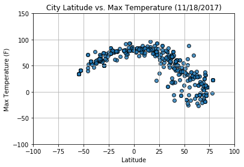
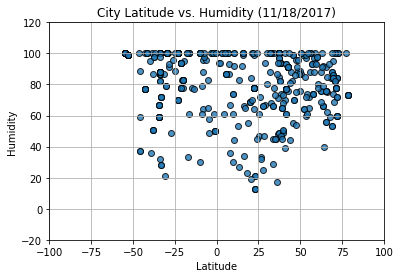
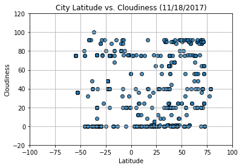
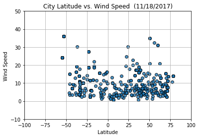

# WeatherPy

Trend 1 Max temperature occurs near equator, latitude did have an impact on temperature

Trend 2 Latitude seems doesn't have an impact on Cloudiness and Hudimity

Trend 3 latitude seems to have some impact on wind speed but less relevant when compare to temperature vs latitude


```python
# Dependencies
import json
import random
import requests
import numpy as np
import pandas as pd
import matplotlib.pyplot as plt
import openweathermapy.core as ow
from config import gkey
from citipy import citipy
```


```python
# Select Random Latitude and Longitude
city = pd.DataFrame()

for x in range (550):
    ran_lats= np.random.uniform(low=-90.000, high=90.000, size=1)
    ran_lngs= np.random.uniform(low=-180.000, high=180.000, size=1)
    ran_city = pd.DataFrame([[ran_lats, ran_lngs]],columns = ["ran_lats", "ran_lngs"]).astype(float)
    city=city.append(ran_city)
new_city=city.reset_index()
new_city.head()
```


<div>
<style>
    .dataframe thead tr:only-child th {
        text-align: right;
    }

    .dataframe thead th {
        text-align: left;
    }

    .dataframe tbody tr th {
        vertical-align: top;
    }
</style>
<table border="1" class="dataframe">
  <thead>
    <tr style="text-align: right;">
      <th></th>
      <th>index</th>
      <th>ran_lats</th>
      <th>ran_lngs</th>
    </tr>
  </thead>
  <tbody>
    <tr>
      <th>0</th>
      <td>0</td>
      <td>86.346409</td>
      <td>20.269960</td>
    </tr>
    <tr>
      <th>1</th>
      <td>0</td>
      <td>30.525635</td>
      <td>64.346766</td>
    </tr>
    <tr>
      <th>2</th>
      <td>0</td>
      <td>70.278980</td>
      <td>170.526909</td>
    </tr>
    <tr>
      <th>3</th>
      <td>0</td>
      <td>-60.464217</td>
      <td>-44.400695</td>
    </tr>
    <tr>
      <th>4</th>
      <td>0</td>
      <td>-79.209014</td>
      <td>140.305761</td>
    </tr>
  </tbody>
</table>
</div>


```python
# Find Nearby City Name
for n in range(0, len(new_city)):
    city_lat = new_city.loc[n]["ran_lats"]
    city_lngs = new_city.loc[n]["ran_lngs"]
    city = citipy.nearest_city(city_lat, city_lngs)
    new_city.set_value(n, "City Name", city.city_name.title())
    new_city.set_value(n, "Country", city.country_code.upper())
new_city1=new_city.drop("index", axis=1)
new_city1.head()
```


<div>
<style>
    .dataframe thead tr:only-child th {
        text-align: right;
    }

    .dataframe thead th {
        text-align: left;
    }

    .dataframe tbody tr th {
        vertical-align: top;
    }
</style>
<table border="1" class="dataframe">
  <thead>
    <tr style="text-align: right;">
      <th></th>
      <th>ran_lats</th>
      <th>ran_lngs</th>
      <th>City Name</th>
      <th>Country</th>
    </tr>
  </thead>
  <tbody>
    <tr>
      <th>0</th>
      <td>86.346409</td>
      <td>20.269960</td>
      <td>Longyearbyen</td>
      <td>SJ</td>
    </tr>
    <tr>
      <th>1</th>
      <td>30.525635</td>
      <td>64.346766</td>
      <td>Geresk</td>
      <td>AF</td>
    </tr>
    <tr>
      <th>2</th>
      <td>70.278980</td>
      <td>170.526909</td>
      <td>Pevek</td>
      <td>RU</td>
    </tr>
    <tr>
      <th>3</th>
      <td>-60.464217</td>
      <td>-44.400695</td>
      <td>Ushuaia</td>
      <td>AR</td>
    </tr>
    <tr>
      <th>4</th>
      <td>-79.209014</td>
      <td>140.305761</td>
      <td>Hobart</td>
      <td>AU</td>
    </tr>
  </tbody>
</table>
</div>


```python
# Create blank columns for necessary fields
new_city1["Lat"] = ""
new_city1["Lng"] = ""

# Counter
row_count = 0

# Loop through and grab the lat/lng using Google maps
for index, row in new_city1.iterrows():
    
    # Create endpoint URL
    params = {
        "address": row["City Name"],
        "key": gkey
    }
    target_url = "https://maps.googleapis.com/maps/api/geocode/json"
    
    # Print log to ensure loop is working correctly
    print("Now retrieving city # " + str(row_count))
    print(target_url)
    row_count += 1
    
    # Run requests to grab the JSON at the requested URL
    city_location = requests.get(target_url, params=params).json()
    
    # Append the lat/lng to the appropriate columns
    # Use try / except to skip any cities with errors
    try: 
        city_lat = city_location["results"][0]["geometry"]["location"]["lat"]
        city_lng = city_location["results"][0]["geometry"]["location"]["lng"]
        
        new_city1.set_value(index, "Lat", city_lat)
        new_city1.set_value(index, "Lng", city_lng)
        
    except:
        print("Error with city data. Skipping")
        continue
        
# Visualize
new_city1.head()
```

    Now retrieving city # 0
    https://maps.googleapis.com/maps/api/geocode/json
    Now retrieving city # 1
    https://maps.googleapis.com/maps/api/geocode/json
    Now retrieving city # 2
    https://maps.googleapis.com/maps/api/geocode/json
    Now retrieving city # 3
    https://maps.googleapis.com/maps/api/geocode/json
    Now retrieving city # 4
    https://maps.googleapis.com/maps/api/geocode/json
    Now retrieving city # 5
    https://maps.googleapis.com/maps/api/geocode/json
    Now retrieving city # 6
    https://maps.googleapis.com/maps/api/geocode/json
    Now retrieving city # 7
    https://maps.googleapis.com/maps/api/geocode/json
    Now retrieving city # 8
    https://maps.googleapis.com/maps/api/geocode/json
    Now retrieving city # 9
    https://maps.googleapis.com/maps/api/geocode/json
    Now retrieving city # 10
    https://maps.googleapis.com/maps/api/geocode/json
    Now retrieving city # 11
    https://maps.googleapis.com/maps/api/geocode/json
    Now retrieving city # 12
    https://maps.googleapis.com/maps/api/geocode/json
    Now retrieving city # 13
    https://maps.googleapis.com/maps/api/geocode/json
    Now retrieving city # 14
    https://maps.googleapis.com/maps/api/geocode/json
    Now retrieving city # 15
    https://maps.googleapis.com/maps/api/geocode/json
    Now retrieving city # 16
    https://maps.googleapis.com/maps/api/geocode/json
    Now retrieving city # 17
    https://maps.googleapis.com/maps/api/geocode/json
    Now retrieving city # 18
    https://maps.googleapis.com/maps/api/geocode/json
    Now retrieving city # 19
    https://maps.googleapis.com/maps/api/geocode/json
    Now retrieving city # 20
    https://maps.googleapis.com/maps/api/geocode/json
    Now retrieving city # 21
    https://maps.googleapis.com/maps/api/geocode/json
    Now retrieving city # 22
    https://maps.googleapis.com/maps/api/geocode/json
    Now retrieving city # 23
    https://maps.googleapis.com/maps/api/geocode/json
    Now retrieving city # 24
    https://maps.googleapis.com/maps/api/geocode/json
    Now retrieving city # 25
    https://maps.googleapis.com/maps/api/geocode/json
    Now retrieving city # 26
    https://maps.googleapis.com/maps/api/geocode/json
    Now retrieving city # 27
    https://maps.googleapis.com/maps/api/geocode/json
    Now retrieving city # 28
    https://maps.googleapis.com/maps/api/geocode/json
    Now retrieving city # 29
    https://maps.googleapis.com/maps/api/geocode/json
    Now retrieving city # 30
    https://maps.googleapis.com/maps/api/geocode/json
    Now retrieving city # 31
    https://maps.googleapis.com/maps/api/geocode/json
    Now retrieving city # 32
    https://maps.googleapis.com/maps/api/geocode/json
    Now retrieving city # 33
    https://maps.googleapis.com/maps/api/geocode/json
    Now retrieving city # 34
    https://maps.googleapis.com/maps/api/geocode/json
    Now retrieving city # 35
    https://maps.googleapis.com/maps/api/geocode/json
    Now retrieving city # 36
    https://maps.googleapis.com/maps/api/geocode/json
    Now retrieving city # 37
    https://maps.googleapis.com/maps/api/geocode/json
    Now retrieving city # 38
    https://maps.googleapis.com/maps/api/geocode/json
    Now retrieving city # 39
    https://maps.googleapis.com/maps/api/geocode/json
    Now retrieving city # 40
    https://maps.googleapis.com/maps/api/geocode/json
    Now retrieving city # 41
    https://maps.googleapis.com/maps/api/geocode/json
    Now retrieving city # 42
    https://maps.googleapis.com/maps/api/geocode/json
    Now retrieving city # 43
    https://maps.googleapis.com/maps/api/geocode/json
    Now retrieving city # 44
    https://maps.googleapis.com/maps/api/geocode/json
    Now retrieving city # 45
    https://maps.googleapis.com/maps/api/geocode/json
    Now retrieving city # 46
    https://maps.googleapis.com/maps/api/geocode/json
    Now retrieving city # 47
    https://maps.googleapis.com/maps/api/geocode/json
    Now retrieving city # 48
    https://maps.googleapis.com/maps/api/geocode/json
    Now retrieving city # 49
    https://maps.googleapis.com/maps/api/geocode/json
    Now retrieving city # 50
    https://maps.googleapis.com/maps/api/geocode/json
    Now retrieving city # 51
    https://maps.googleapis.com/maps/api/geocode/json
    Now retrieving city # 52
    https://maps.googleapis.com/maps/api/geocode/json
    Now retrieving city # 53
    https://maps.googleapis.com/maps/api/geocode/json
    Now retrieving city # 54
    https://maps.googleapis.com/maps/api/geocode/json
    Now retrieving city # 55
    https://maps.googleapis.com/maps/api/geocode/json
    Now retrieving city # 56
    https://maps.googleapis.com/maps/api/geocode/json
    Now retrieving city # 57
    https://maps.googleapis.com/maps/api/geocode/json
    Now retrieving city # 58
    https://maps.googleapis.com/maps/api/geocode/json
    Now retrieving city # 59
    https://maps.googleapis.com/maps/api/geocode/json
    Now retrieving city # 60
    https://maps.googleapis.com/maps/api/geocode/json
    Now retrieving city # 61
    https://maps.googleapis.com/maps/api/geocode/json
    Now retrieving city # 62
    https://maps.googleapis.com/maps/api/geocode/json
    Now retrieving city # 63
    https://maps.googleapis.com/maps/api/geocode/json
    Now retrieving city # 64
    https://maps.googleapis.com/maps/api/geocode/json
    Now retrieving city # 65
    https://maps.googleapis.com/maps/api/geocode/json
    Now retrieving city # 66
    https://maps.googleapis.com/maps/api/geocode/json
    Now retrieving city # 67
    https://maps.googleapis.com/maps/api/geocode/json
    Now retrieving city # 68
    https://maps.googleapis.com/maps/api/geocode/json
    Now retrieving city # 69
    https://maps.googleapis.com/maps/api/geocode/json
    Now retrieving city # 70
    https://maps.googleapis.com/maps/api/geocode/json
    Now retrieving city # 71
    https://maps.googleapis.com/maps/api/geocode/json
    Now retrieving city # 72
    https://maps.googleapis.com/maps/api/geocode/json
    Now retrieving city # 73
    https://maps.googleapis.com/maps/api/geocode/json
    Now retrieving city # 74
    https://maps.googleapis.com/maps/api/geocode/json
    Now retrieving city # 75
    https://maps.googleapis.com/maps/api/geocode/json
    Now retrieving city # 76
    https://maps.googleapis.com/maps/api/geocode/json
    Now retrieving city # 77
    https://maps.googleapis.com/maps/api/geocode/json
    Now retrieving city # 78
    https://maps.googleapis.com/maps/api/geocode/json
    Now retrieving city # 79
    https://maps.googleapis.com/maps/api/geocode/json
    Now retrieving city # 80
    https://maps.googleapis.com/maps/api/geocode/json
    Now retrieving city # 81
    https://maps.googleapis.com/maps/api/geocode/json
    Now retrieving city # 82
    https://maps.googleapis.com/maps/api/geocode/json
    Now retrieving city # 83
    https://maps.googleapis.com/maps/api/geocode/json
    Now retrieving city # 84
    https://maps.googleapis.com/maps/api/geocode/json
    Now retrieving city # 85
    https://maps.googleapis.com/maps/api/geocode/json
    Now retrieving city # 86
    https://maps.googleapis.com/maps/api/geocode/json
    Now retrieving city # 87
    https://maps.googleapis.com/maps/api/geocode/json
    Now retrieving city # 88
    https://maps.googleapis.com/maps/api/geocode/json
    Now retrieving city # 89
    https://maps.googleapis.com/maps/api/geocode/json
    Now retrieving city # 90
    https://maps.googleapis.com/maps/api/geocode/json
    Now retrieving city # 91
    https://maps.googleapis.com/maps/api/geocode/json
    Now retrieving city # 92
    https://maps.googleapis.com/maps/api/geocode/json
    Now retrieving city # 93
    https://maps.googleapis.com/maps/api/geocode/json
    Now retrieving city # 94
    https://maps.googleapis.com/maps/api/geocode/json
    Now retrieving city # 95
    https://maps.googleapis.com/maps/api/geocode/json
    Now retrieving city # 96
    https://maps.googleapis.com/maps/api/geocode/json
    Now retrieving city # 97
    https://maps.googleapis.com/maps/api/geocode/json
    Now retrieving city # 98
    https://maps.googleapis.com/maps/api/geocode/json
    Now retrieving city # 99
    https://maps.googleapis.com/maps/api/geocode/json
    Now retrieving city # 100
    https://maps.googleapis.com/maps/api/geocode/json
    Now retrieving city # 101
    https://maps.googleapis.com/maps/api/geocode/json
    Now retrieving city # 102
    https://maps.googleapis.com/maps/api/geocode/json
    Now retrieving city # 103
    https://maps.googleapis.com/maps/api/geocode/json
    Now retrieving city # 104
    https://maps.googleapis.com/maps/api/geocode/json
    Now retrieving city # 105
    https://maps.googleapis.com/maps/api/geocode/json
    Now retrieving city # 106
    https://maps.googleapis.com/maps/api/geocode/json
    Now retrieving city # 107
    https://maps.googleapis.com/maps/api/geocode/json
    Now retrieving city # 108
    https://maps.googleapis.com/maps/api/geocode/json
    Now retrieving city # 109
    https://maps.googleapis.com/maps/api/geocode/json
    Now retrieving city # 110
    https://maps.googleapis.com/maps/api/geocode/json
    Now retrieving city # 111
    https://maps.googleapis.com/maps/api/geocode/json
    Now retrieving city # 112
    https://maps.googleapis.com/maps/api/geocode/json
    Now retrieving city # 113
    https://maps.googleapis.com/maps/api/geocode/json
    Now retrieving city # 114
    https://maps.googleapis.com/maps/api/geocode/json
    Now retrieving city # 115
    https://maps.googleapis.com/maps/api/geocode/json
    Now retrieving city # 116
    https://maps.googleapis.com/maps/api/geocode/json
    Now retrieving city # 117
    https://maps.googleapis.com/maps/api/geocode/json
    Now retrieving city # 118
    https://maps.googleapis.com/maps/api/geocode/json
    Now retrieving city # 119
    https://maps.googleapis.com/maps/api/geocode/json
    Now retrieving city # 120
    https://maps.googleapis.com/maps/api/geocode/json
    Now retrieving city # 121
    https://maps.googleapis.com/maps/api/geocode/json
    Now retrieving city # 122
    https://maps.googleapis.com/maps/api/geocode/json
    Now retrieving city # 123
    https://maps.googleapis.com/maps/api/geocode/json
    Now retrieving city # 124
    https://maps.googleapis.com/maps/api/geocode/json
    Now retrieving city # 125
    https://maps.googleapis.com/maps/api/geocode/json
    Now retrieving city # 126
    https://maps.googleapis.com/maps/api/geocode/json
    Now retrieving city # 127
    https://maps.googleapis.com/maps/api/geocode/json
    Now retrieving city # 128
    https://maps.googleapis.com/maps/api/geocode/json
    Now retrieving city # 129
    https://maps.googleapis.com/maps/api/geocode/json
    Now retrieving city # 130
    https://maps.googleapis.com/maps/api/geocode/json
    Now retrieving city # 131
    https://maps.googleapis.com/maps/api/geocode/json
    Now retrieving city # 132
    https://maps.googleapis.com/maps/api/geocode/json
    Now retrieving city # 133
    https://maps.googleapis.com/maps/api/geocode/json
    Now retrieving city # 134
    https://maps.googleapis.com/maps/api/geocode/json
    Now retrieving city # 135
    https://maps.googleapis.com/maps/api/geocode/json
    Now retrieving city # 136
    https://maps.googleapis.com/maps/api/geocode/json
    Now retrieving city # 137
    https://maps.googleapis.com/maps/api/geocode/json
    Now retrieving city # 138
    https://maps.googleapis.com/maps/api/geocode/json
    Now retrieving city # 139
    https://maps.googleapis.com/maps/api/geocode/json
    Now retrieving city # 140
    https://maps.googleapis.com/maps/api/geocode/json
    Now retrieving city # 141
    https://maps.googleapis.com/maps/api/geocode/json
    Now retrieving city # 142
    https://maps.googleapis.com/maps/api/geocode/json
    Now retrieving city # 143
    https://maps.googleapis.com/maps/api/geocode/json
    Now retrieving city # 144
    https://maps.googleapis.com/maps/api/geocode/json
    Now retrieving city # 145
    https://maps.googleapis.com/maps/api/geocode/json
    Now retrieving city # 146
    https://maps.googleapis.com/maps/api/geocode/json
    Now retrieving city # 147
    https://maps.googleapis.com/maps/api/geocode/json
    Now retrieving city # 148
    https://maps.googleapis.com/maps/api/geocode/json
    Now retrieving city # 149
    https://maps.googleapis.com/maps/api/geocode/json
    Now retrieving city # 150
    https://maps.googleapis.com/maps/api/geocode/json
    Now retrieving city # 151
    https://maps.googleapis.com/maps/api/geocode/json
    Now retrieving city # 152
    https://maps.googleapis.com/maps/api/geocode/json
    Now retrieving city # 153
    https://maps.googleapis.com/maps/api/geocode/json
    Now retrieving city # 154
    https://maps.googleapis.com/maps/api/geocode/json
    Now retrieving city # 155
    https://maps.googleapis.com/maps/api/geocode/json
    Now retrieving city # 156
    https://maps.googleapis.com/maps/api/geocode/json
    Now retrieving city # 157
    https://maps.googleapis.com/maps/api/geocode/json
    Now retrieving city # 158
    https://maps.googleapis.com/maps/api/geocode/json
    Now retrieving city # 159
    https://maps.googleapis.com/maps/api/geocode/json
    Now retrieving city # 160
    https://maps.googleapis.com/maps/api/geocode/json
    Now retrieving city # 161
    https://maps.googleapis.com/maps/api/geocode/json
    Now retrieving city # 162
    https://maps.googleapis.com/maps/api/geocode/json
    Now retrieving city # 163
    https://maps.googleapis.com/maps/api/geocode/json
    Now retrieving city # 164
    https://maps.googleapis.com/maps/api/geocode/json
    Now retrieving city # 165
    https://maps.googleapis.com/maps/api/geocode/json
    Now retrieving city # 166
    https://maps.googleapis.com/maps/api/geocode/json
    Now retrieving city # 167
    https://maps.googleapis.com/maps/api/geocode/json
    Now retrieving city # 168
    https://maps.googleapis.com/maps/api/geocode/json
    Now retrieving city # 169
    https://maps.googleapis.com/maps/api/geocode/json
    Now retrieving city # 170
    https://maps.googleapis.com/maps/api/geocode/json
    Now retrieving city # 171
    https://maps.googleapis.com/maps/api/geocode/json
    Now retrieving city # 172
    https://maps.googleapis.com/maps/api/geocode/json
    Now retrieving city # 173
    https://maps.googleapis.com/maps/api/geocode/json
    Now retrieving city # 174
    https://maps.googleapis.com/maps/api/geocode/json
    Now retrieving city # 175
    https://maps.googleapis.com/maps/api/geocode/json
    Now retrieving city # 176
    https://maps.googleapis.com/maps/api/geocode/json
    Now retrieving city # 177
    https://maps.googleapis.com/maps/api/geocode/json
    Now retrieving city # 178
    https://maps.googleapis.com/maps/api/geocode/json
    Now retrieving city # 179
    https://maps.googleapis.com/maps/api/geocode/json
    Now retrieving city # 180
    https://maps.googleapis.com/maps/api/geocode/json
    Now retrieving city # 181
    https://maps.googleapis.com/maps/api/geocode/json
    Now retrieving city # 182
    https://maps.googleapis.com/maps/api/geocode/json
    Now retrieving city # 183
    https://maps.googleapis.com/maps/api/geocode/json
    Now retrieving city # 184
    https://maps.googleapis.com/maps/api/geocode/json
    Now retrieving city # 185
    https://maps.googleapis.com/maps/api/geocode/json
    Now retrieving city # 186
    https://maps.googleapis.com/maps/api/geocode/json
    Now retrieving city # 187
    https://maps.googleapis.com/maps/api/geocode/json
    Now retrieving city # 188
    https://maps.googleapis.com/maps/api/geocode/json
    Now retrieving city # 189
    https://maps.googleapis.com/maps/api/geocode/json
    Now retrieving city # 190
    https://maps.googleapis.com/maps/api/geocode/json
    Now retrieving city # 191
    https://maps.googleapis.com/maps/api/geocode/json
    Now retrieving city # 192
    https://maps.googleapis.com/maps/api/geocode/json
    Now retrieving city # 193
    https://maps.googleapis.com/maps/api/geocode/json
    Now retrieving city # 194
    https://maps.googleapis.com/maps/api/geocode/json
    Now retrieving city # 195
    https://maps.googleapis.com/maps/api/geocode/json
    Now retrieving city # 196
    https://maps.googleapis.com/maps/api/geocode/json
    Now retrieving city # 197
    https://maps.googleapis.com/maps/api/geocode/json
    Now retrieving city # 198
    https://maps.googleapis.com/maps/api/geocode/json
    Now retrieving city # 199
    https://maps.googleapis.com/maps/api/geocode/json
    Now retrieving city # 200
    https://maps.googleapis.com/maps/api/geocode/json
    Now retrieving city # 201
    https://maps.googleapis.com/maps/api/geocode/json
    Now retrieving city # 202
    https://maps.googleapis.com/maps/api/geocode/json
    Now retrieving city # 203
    https://maps.googleapis.com/maps/api/geocode/json
    Now retrieving city # 204
    https://maps.googleapis.com/maps/api/geocode/json
    Now retrieving city # 205
    https://maps.googleapis.com/maps/api/geocode/json
    Now retrieving city # 206
    https://maps.googleapis.com/maps/api/geocode/json
    Now retrieving city # 207
    https://maps.googleapis.com/maps/api/geocode/json
    Now retrieving city # 208
    https://maps.googleapis.com/maps/api/geocode/json
    Now retrieving city # 209
    https://maps.googleapis.com/maps/api/geocode/json
    Now retrieving city # 210
    https://maps.googleapis.com/maps/api/geocode/json
    Now retrieving city # 211
    https://maps.googleapis.com/maps/api/geocode/json
    Now retrieving city # 212
    https://maps.googleapis.com/maps/api/geocode/json
    Now retrieving city # 213
    https://maps.googleapis.com/maps/api/geocode/json
    Now retrieving city # 214
    https://maps.googleapis.com/maps/api/geocode/json
    Now retrieving city # 215
    https://maps.googleapis.com/maps/api/geocode/json
    Now retrieving city # 216
    https://maps.googleapis.com/maps/api/geocode/json
    Now retrieving city # 217
    https://maps.googleapis.com/maps/api/geocode/json
    Now retrieving city # 218
    https://maps.googleapis.com/maps/api/geocode/json
    Now retrieving city # 219
    https://maps.googleapis.com/maps/api/geocode/json
    Now retrieving city # 220
    https://maps.googleapis.com/maps/api/geocode/json
    Now retrieving city # 221
    https://maps.googleapis.com/maps/api/geocode/json
    Now retrieving city # 222
    https://maps.googleapis.com/maps/api/geocode/json
    Now retrieving city # 223
    https://maps.googleapis.com/maps/api/geocode/json
    Now retrieving city # 224
    https://maps.googleapis.com/maps/api/geocode/json
    Now retrieving city # 225
    https://maps.googleapis.com/maps/api/geocode/json
    Now retrieving city # 226
    https://maps.googleapis.com/maps/api/geocode/json
    Now retrieving city # 227
    https://maps.googleapis.com/maps/api/geocode/json
    Now retrieving city # 228
    https://maps.googleapis.com/maps/api/geocode/json
    Now retrieving city # 229
    https://maps.googleapis.com/maps/api/geocode/json
    Now retrieving city # 230
    https://maps.googleapis.com/maps/api/geocode/json
    Now retrieving city # 231
    https://maps.googleapis.com/maps/api/geocode/json
    Now retrieving city # 232
    https://maps.googleapis.com/maps/api/geocode/json
    Now retrieving city # 233
    https://maps.googleapis.com/maps/api/geocode/json
    Now retrieving city # 234
    https://maps.googleapis.com/maps/api/geocode/json
    Now retrieving city # 235
    https://maps.googleapis.com/maps/api/geocode/json
    Now retrieving city # 236
    https://maps.googleapis.com/maps/api/geocode/json
    Now retrieving city # 237
    https://maps.googleapis.com/maps/api/geocode/json
    Now retrieving city # 238
    https://maps.googleapis.com/maps/api/geocode/json
    Now retrieving city # 239
    https://maps.googleapis.com/maps/api/geocode/json
    Now retrieving city # 240
    https://maps.googleapis.com/maps/api/geocode/json
    Now retrieving city # 241
    https://maps.googleapis.com/maps/api/geocode/json
    Now retrieving city # 242
    https://maps.googleapis.com/maps/api/geocode/json
    Now retrieving city # 243
    https://maps.googleapis.com/maps/api/geocode/json
    Now retrieving city # 244
    https://maps.googleapis.com/maps/api/geocode/json
    Now retrieving city # 245
    https://maps.googleapis.com/maps/api/geocode/json
    Now retrieving city # 246
    https://maps.googleapis.com/maps/api/geocode/json
    Now retrieving city # 247
    https://maps.googleapis.com/maps/api/geocode/json
    Now retrieving city # 248
    https://maps.googleapis.com/maps/api/geocode/json
    Now retrieving city # 249
    https://maps.googleapis.com/maps/api/geocode/json
    Now retrieving city # 250
    https://maps.googleapis.com/maps/api/geocode/json
    Now retrieving city # 251
    https://maps.googleapis.com/maps/api/geocode/json
    Now retrieving city # 252
    https://maps.googleapis.com/maps/api/geocode/json
    Now retrieving city # 253
    https://maps.googleapis.com/maps/api/geocode/json
    Now retrieving city # 254
    https://maps.googleapis.com/maps/api/geocode/json
    Now retrieving city # 255
    https://maps.googleapis.com/maps/api/geocode/json
    Now retrieving city # 256
    https://maps.googleapis.com/maps/api/geocode/json
    Now retrieving city # 257
    https://maps.googleapis.com/maps/api/geocode/json
    Now retrieving city # 258
    https://maps.googleapis.com/maps/api/geocode/json
    Now retrieving city # 259
    https://maps.googleapis.com/maps/api/geocode/json
    Now retrieving city # 260
    https://maps.googleapis.com/maps/api/geocode/json
    Now retrieving city # 261
    https://maps.googleapis.com/maps/api/geocode/json
    Now retrieving city # 262
    https://maps.googleapis.com/maps/api/geocode/json
    Now retrieving city # 263
    https://maps.googleapis.com/maps/api/geocode/json
    Now retrieving city # 264
    https://maps.googleapis.com/maps/api/geocode/json
    Now retrieving city # 265
    https://maps.googleapis.com/maps/api/geocode/json
    Now retrieving city # 266
    https://maps.googleapis.com/maps/api/geocode/json
    Now retrieving city # 267
    https://maps.googleapis.com/maps/api/geocode/json
    Now retrieving city # 268
    https://maps.googleapis.com/maps/api/geocode/json
    Now retrieving city # 269
    https://maps.googleapis.com/maps/api/geocode/json
    Now retrieving city # 270
    https://maps.googleapis.com/maps/api/geocode/json
    Now retrieving city # 271
    https://maps.googleapis.com/maps/api/geocode/json
    Now retrieving city # 272
    https://maps.googleapis.com/maps/api/geocode/json
    Now retrieving city # 273
    https://maps.googleapis.com/maps/api/geocode/json
    Now retrieving city # 274
    https://maps.googleapis.com/maps/api/geocode/json
    Now retrieving city # 275
    https://maps.googleapis.com/maps/api/geocode/json
    Now retrieving city # 276
    https://maps.googleapis.com/maps/api/geocode/json
    Now retrieving city # 277
    https://maps.googleapis.com/maps/api/geocode/json
    Now retrieving city # 278
    https://maps.googleapis.com/maps/api/geocode/json
    Now retrieving city # 279
    https://maps.googleapis.com/maps/api/geocode/json
    Now retrieving city # 280
    https://maps.googleapis.com/maps/api/geocode/json
    Now retrieving city # 281
    https://maps.googleapis.com/maps/api/geocode/json
    Now retrieving city # 282
    https://maps.googleapis.com/maps/api/geocode/json
    Now retrieving city # 283
    https://maps.googleapis.com/maps/api/geocode/json
    Now retrieving city # 284
    https://maps.googleapis.com/maps/api/geocode/json
    Now retrieving city # 285
    https://maps.googleapis.com/maps/api/geocode/json
    Now retrieving city # 286
    https://maps.googleapis.com/maps/api/geocode/json
    Now retrieving city # 287
    https://maps.googleapis.com/maps/api/geocode/json
    Now retrieving city # 288
    https://maps.googleapis.com/maps/api/geocode/json
    Now retrieving city # 289
    https://maps.googleapis.com/maps/api/geocode/json
    Now retrieving city # 290
    https://maps.googleapis.com/maps/api/geocode/json
    Now retrieving city # 291
    https://maps.googleapis.com/maps/api/geocode/json
    Now retrieving city # 292
    https://maps.googleapis.com/maps/api/geocode/json
    Now retrieving city # 293
    https://maps.googleapis.com/maps/api/geocode/json
    Now retrieving city # 294
    https://maps.googleapis.com/maps/api/geocode/json
    Now retrieving city # 295
    https://maps.googleapis.com/maps/api/geocode/json
    Now retrieving city # 296
    https://maps.googleapis.com/maps/api/geocode/json
    Now retrieving city # 297
    https://maps.googleapis.com/maps/api/geocode/json
    Now retrieving city # 298
    https://maps.googleapis.com/maps/api/geocode/json
    Now retrieving city # 299
    https://maps.googleapis.com/maps/api/geocode/json
    Now retrieving city # 300
    https://maps.googleapis.com/maps/api/geocode/json
    Now retrieving city # 301
    https://maps.googleapis.com/maps/api/geocode/json
    Now retrieving city # 302
    https://maps.googleapis.com/maps/api/geocode/json
    Now retrieving city # 303
    https://maps.googleapis.com/maps/api/geocode/json
    Now retrieving city # 304
    https://maps.googleapis.com/maps/api/geocode/json
    Now retrieving city # 305
    https://maps.googleapis.com/maps/api/geocode/json
    Now retrieving city # 306
    https://maps.googleapis.com/maps/api/geocode/json
    Now retrieving city # 307
    https://maps.googleapis.com/maps/api/geocode/json
    Now retrieving city # 308
    https://maps.googleapis.com/maps/api/geocode/json
    Now retrieving city # 309
    https://maps.googleapis.com/maps/api/geocode/json
    Now retrieving city # 310
    https://maps.googleapis.com/maps/api/geocode/json
    Now retrieving city # 311
    https://maps.googleapis.com/maps/api/geocode/json
    Now retrieving city # 312
    https://maps.googleapis.com/maps/api/geocode/json
    Now retrieving city # 313
    https://maps.googleapis.com/maps/api/geocode/json
    Now retrieving city # 314
    https://maps.googleapis.com/maps/api/geocode/json
    Now retrieving city # 315
    https://maps.googleapis.com/maps/api/geocode/json
    Now retrieving city # 316
    https://maps.googleapis.com/maps/api/geocode/json
    Now retrieving city # 317
    https://maps.googleapis.com/maps/api/geocode/json
    Now retrieving city # 318
    https://maps.googleapis.com/maps/api/geocode/json
    Now retrieving city # 319
    https://maps.googleapis.com/maps/api/geocode/json
    Now retrieving city # 320
    https://maps.googleapis.com/maps/api/geocode/json
    Now retrieving city # 321
    https://maps.googleapis.com/maps/api/geocode/json
    Now retrieving city # 322
    https://maps.googleapis.com/maps/api/geocode/json
    Now retrieving city # 323
    https://maps.googleapis.com/maps/api/geocode/json
    Now retrieving city # 324
    https://maps.googleapis.com/maps/api/geocode/json
    Now retrieving city # 325
    https://maps.googleapis.com/maps/api/geocode/json
    Now retrieving city # 326
    https://maps.googleapis.com/maps/api/geocode/json
    Now retrieving city # 327
    https://maps.googleapis.com/maps/api/geocode/json
    Now retrieving city # 328
    https://maps.googleapis.com/maps/api/geocode/json
    Now retrieving city # 329
    https://maps.googleapis.com/maps/api/geocode/json
    Now retrieving city # 330
    https://maps.googleapis.com/maps/api/geocode/json
    Now retrieving city # 331
    https://maps.googleapis.com/maps/api/geocode/json
    Now retrieving city # 332
    https://maps.googleapis.com/maps/api/geocode/json
    Now retrieving city # 333
    https://maps.googleapis.com/maps/api/geocode/json
    Now retrieving city # 334
    https://maps.googleapis.com/maps/api/geocode/json
    Now retrieving city # 335
    https://maps.googleapis.com/maps/api/geocode/json
    Now retrieving city # 336
    https://maps.googleapis.com/maps/api/geocode/json
    Now retrieving city # 337
    https://maps.googleapis.com/maps/api/geocode/json
    Now retrieving city # 338
    https://maps.googleapis.com/maps/api/geocode/json
    Now retrieving city # 339
    https://maps.googleapis.com/maps/api/geocode/json
    Now retrieving city # 340
    https://maps.googleapis.com/maps/api/geocode/json
    Now retrieving city # 341
    https://maps.googleapis.com/maps/api/geocode/json
    Now retrieving city # 342
    https://maps.googleapis.com/maps/api/geocode/json
    Now retrieving city # 343
    https://maps.googleapis.com/maps/api/geocode/json
    Now retrieving city # 344
    https://maps.googleapis.com/maps/api/geocode/json
    Now retrieving city # 345
    https://maps.googleapis.com/maps/api/geocode/json
    Now retrieving city # 346
    https://maps.googleapis.com/maps/api/geocode/json
    Now retrieving city # 347
    https://maps.googleapis.com/maps/api/geocode/json
    Now retrieving city # 348
    https://maps.googleapis.com/maps/api/geocode/json
    Now retrieving city # 349
    https://maps.googleapis.com/maps/api/geocode/json
    Now retrieving city # 350
    https://maps.googleapis.com/maps/api/geocode/json
    Now retrieving city # 351
    https://maps.googleapis.com/maps/api/geocode/json
    Now retrieving city # 352
    https://maps.googleapis.com/maps/api/geocode/json
    Now retrieving city # 353
    https://maps.googleapis.com/maps/api/geocode/json
    Now retrieving city # 354
    https://maps.googleapis.com/maps/api/geocode/json
    Now retrieving city # 355
    https://maps.googleapis.com/maps/api/geocode/json
    Now retrieving city # 356
    https://maps.googleapis.com/maps/api/geocode/json
    Now retrieving city # 357
    https://maps.googleapis.com/maps/api/geocode/json
    Now retrieving city # 358
    https://maps.googleapis.com/maps/api/geocode/json
    Now retrieving city # 359
    https://maps.googleapis.com/maps/api/geocode/json
    Now retrieving city # 360
    https://maps.googleapis.com/maps/api/geocode/json
    Now retrieving city # 361
    https://maps.googleapis.com/maps/api/geocode/json
    Now retrieving city # 362
    https://maps.googleapis.com/maps/api/geocode/json
    Now retrieving city # 363
    https://maps.googleapis.com/maps/api/geocode/json
    Now retrieving city # 364
    https://maps.googleapis.com/maps/api/geocode/json
    Now retrieving city # 365
    https://maps.googleapis.com/maps/api/geocode/json
    Now retrieving city # 366
    https://maps.googleapis.com/maps/api/geocode/json
    Now retrieving city # 367
    https://maps.googleapis.com/maps/api/geocode/json
    Now retrieving city # 368
    https://maps.googleapis.com/maps/api/geocode/json
    Now retrieving city # 369
    https://maps.googleapis.com/maps/api/geocode/json
    Now retrieving city # 370
    https://maps.googleapis.com/maps/api/geocode/json
    Now retrieving city # 371
    https://maps.googleapis.com/maps/api/geocode/json
    Now retrieving city # 372
    https://maps.googleapis.com/maps/api/geocode/json
    Now retrieving city # 373
    https://maps.googleapis.com/maps/api/geocode/json
    Now retrieving city # 374
    https://maps.googleapis.com/maps/api/geocode/json
    Now retrieving city # 375
    https://maps.googleapis.com/maps/api/geocode/json
    Now retrieving city # 376
    https://maps.googleapis.com/maps/api/geocode/json
    Now retrieving city # 377
    https://maps.googleapis.com/maps/api/geocode/json
    Now retrieving city # 378
    https://maps.googleapis.com/maps/api/geocode/json
    Now retrieving city # 379
    https://maps.googleapis.com/maps/api/geocode/json
    Now retrieving city # 380
    https://maps.googleapis.com/maps/api/geocode/json
    Now retrieving city # 381
    https://maps.googleapis.com/maps/api/geocode/json
    Now retrieving city # 382
    https://maps.googleapis.com/maps/api/geocode/json
    Now retrieving city # 383
    https://maps.googleapis.com/maps/api/geocode/json
    Now retrieving city # 384
    https://maps.googleapis.com/maps/api/geocode/json
    Now retrieving city # 385
    https://maps.googleapis.com/maps/api/geocode/json
    Now retrieving city # 386
    https://maps.googleapis.com/maps/api/geocode/json
    Now retrieving city # 387
    https://maps.googleapis.com/maps/api/geocode/json
    Now retrieving city # 388
    https://maps.googleapis.com/maps/api/geocode/json
    Now retrieving city # 389
    https://maps.googleapis.com/maps/api/geocode/json
    Now retrieving city # 390
    https://maps.googleapis.com/maps/api/geocode/json
    Now retrieving city # 391
    https://maps.googleapis.com/maps/api/geocode/json
    Now retrieving city # 392
    https://maps.googleapis.com/maps/api/geocode/json
    Now retrieving city # 393
    https://maps.googleapis.com/maps/api/geocode/json
    Now retrieving city # 394
    https://maps.googleapis.com/maps/api/geocode/json
    Now retrieving city # 395
    https://maps.googleapis.com/maps/api/geocode/json
    Now retrieving city # 396
    https://maps.googleapis.com/maps/api/geocode/json
    Now retrieving city # 397
    https://maps.googleapis.com/maps/api/geocode/json
    Now retrieving city # 398
    https://maps.googleapis.com/maps/api/geocode/json
    Now retrieving city # 399
    https://maps.googleapis.com/maps/api/geocode/json
    Now retrieving city # 400
    https://maps.googleapis.com/maps/api/geocode/json
    Now retrieving city # 401
    https://maps.googleapis.com/maps/api/geocode/json
    Now retrieving city # 402
    https://maps.googleapis.com/maps/api/geocode/json
    Now retrieving city # 403
    https://maps.googleapis.com/maps/api/geocode/json
    Now retrieving city # 404
    https://maps.googleapis.com/maps/api/geocode/json
    Now retrieving city # 405
    https://maps.googleapis.com/maps/api/geocode/json
    Now retrieving city # 406
    https://maps.googleapis.com/maps/api/geocode/json
    Now retrieving city # 407
    https://maps.googleapis.com/maps/api/geocode/json
    Now retrieving city # 408
    https://maps.googleapis.com/maps/api/geocode/json
    Now retrieving city # 409
    https://maps.googleapis.com/maps/api/geocode/json
    Now retrieving city # 410
    https://maps.googleapis.com/maps/api/geocode/json
    Now retrieving city # 411
    https://maps.googleapis.com/maps/api/geocode/json
    Now retrieving city # 412
    https://maps.googleapis.com/maps/api/geocode/json
    Now retrieving city # 413
    https://maps.googleapis.com/maps/api/geocode/json
    Now retrieving city # 414
    https://maps.googleapis.com/maps/api/geocode/json
    Now retrieving city # 415
    https://maps.googleapis.com/maps/api/geocode/json
    Now retrieving city # 416
    https://maps.googleapis.com/maps/api/geocode/json
    Now retrieving city # 417
    https://maps.googleapis.com/maps/api/geocode/json
    Now retrieving city # 418
    https://maps.googleapis.com/maps/api/geocode/json
    Now retrieving city # 419
    https://maps.googleapis.com/maps/api/geocode/json
    Now retrieving city # 420
    https://maps.googleapis.com/maps/api/geocode/json
    Now retrieving city # 421
    https://maps.googleapis.com/maps/api/geocode/json
    Now retrieving city # 422
    https://maps.googleapis.com/maps/api/geocode/json
    Now retrieving city # 423
    https://maps.googleapis.com/maps/api/geocode/json
    Now retrieving city # 424
    https://maps.googleapis.com/maps/api/geocode/json
    Now retrieving city # 425
    https://maps.googleapis.com/maps/api/geocode/json
    Now retrieving city # 426
    https://maps.googleapis.com/maps/api/geocode/json
    Now retrieving city # 427
    https://maps.googleapis.com/maps/api/geocode/json
    Now retrieving city # 428
    https://maps.googleapis.com/maps/api/geocode/json
    Now retrieving city # 429
    https://maps.googleapis.com/maps/api/geocode/json
    Now retrieving city # 430
    https://maps.googleapis.com/maps/api/geocode/json
    Now retrieving city # 431
    https://maps.googleapis.com/maps/api/geocode/json
    Now retrieving city # 432
    https://maps.googleapis.com/maps/api/geocode/json
    Now retrieving city # 433
    https://maps.googleapis.com/maps/api/geocode/json
    Now retrieving city # 434
    https://maps.googleapis.com/maps/api/geocode/json
    Now retrieving city # 435
    https://maps.googleapis.com/maps/api/geocode/json
    Now retrieving city # 436
    https://maps.googleapis.com/maps/api/geocode/json
    Now retrieving city # 437
    https://maps.googleapis.com/maps/api/geocode/json
    Now retrieving city # 438
    https://maps.googleapis.com/maps/api/geocode/json
    Now retrieving city # 439
    https://maps.googleapis.com/maps/api/geocode/json
    Now retrieving city # 440
    https://maps.googleapis.com/maps/api/geocode/json
    Now retrieving city # 441
    https://maps.googleapis.com/maps/api/geocode/json
    Now retrieving city # 442
    https://maps.googleapis.com/maps/api/geocode/json
    Now retrieving city # 443
    https://maps.googleapis.com/maps/api/geocode/json
    Now retrieving city # 444
    https://maps.googleapis.com/maps/api/geocode/json
    Now retrieving city # 445
    https://maps.googleapis.com/maps/api/geocode/json
    Now retrieving city # 446
    https://maps.googleapis.com/maps/api/geocode/json
    Now retrieving city # 447
    https://maps.googleapis.com/maps/api/geocode/json
    Now retrieving city # 448
    https://maps.googleapis.com/maps/api/geocode/json
    Now retrieving city # 449
    https://maps.googleapis.com/maps/api/geocode/json
    Now retrieving city # 450
    https://maps.googleapis.com/maps/api/geocode/json
    Now retrieving city # 451
    https://maps.googleapis.com/maps/api/geocode/json
    Now retrieving city # 452
    https://maps.googleapis.com/maps/api/geocode/json
    Now retrieving city # 453
    https://maps.googleapis.com/maps/api/geocode/json
    Now retrieving city # 454
    https://maps.googleapis.com/maps/api/geocode/json
    Now retrieving city # 455
    https://maps.googleapis.com/maps/api/geocode/json
    Now retrieving city # 456
    https://maps.googleapis.com/maps/api/geocode/json
    Now retrieving city # 457
    https://maps.googleapis.com/maps/api/geocode/json
    Now retrieving city # 458
    https://maps.googleapis.com/maps/api/geocode/json
    Now retrieving city # 459
    https://maps.googleapis.com/maps/api/geocode/json
    Now retrieving city # 460
    https://maps.googleapis.com/maps/api/geocode/json
    Now retrieving city # 461
    https://maps.googleapis.com/maps/api/geocode/json
    Now retrieving city # 462
    https://maps.googleapis.com/maps/api/geocode/json
    Now retrieving city # 463
    https://maps.googleapis.com/maps/api/geocode/json
    Now retrieving city # 464
    https://maps.googleapis.com/maps/api/geocode/json
    Now retrieving city # 465
    https://maps.googleapis.com/maps/api/geocode/json
    Now retrieving city # 466
    https://maps.googleapis.com/maps/api/geocode/json
    Now retrieving city # 467
    https://maps.googleapis.com/maps/api/geocode/json
    Now retrieving city # 468
    https://maps.googleapis.com/maps/api/geocode/json
    Now retrieving city # 469
    https://maps.googleapis.com/maps/api/geocode/json
    Now retrieving city # 470
    https://maps.googleapis.com/maps/api/geocode/json
    Now retrieving city # 471
    https://maps.googleapis.com/maps/api/geocode/json
    Now retrieving city # 472
    https://maps.googleapis.com/maps/api/geocode/json
    Now retrieving city # 473
    https://maps.googleapis.com/maps/api/geocode/json
    Now retrieving city # 474
    https://maps.googleapis.com/maps/api/geocode/json
    Now retrieving city # 475
    https://maps.googleapis.com/maps/api/geocode/json
    Now retrieving city # 476
    https://maps.googleapis.com/maps/api/geocode/json
    Now retrieving city # 477
    https://maps.googleapis.com/maps/api/geocode/json
    Now retrieving city # 478
    https://maps.googleapis.com/maps/api/geocode/json
    Now retrieving city # 479
    https://maps.googleapis.com/maps/api/geocode/json
    Now retrieving city # 480
    https://maps.googleapis.com/maps/api/geocode/json
    Now retrieving city # 481
    https://maps.googleapis.com/maps/api/geocode/json
    Now retrieving city # 482
    https://maps.googleapis.com/maps/api/geocode/json
    Now retrieving city # 483
    https://maps.googleapis.com/maps/api/geocode/json
    Now retrieving city # 484
    https://maps.googleapis.com/maps/api/geocode/json
    Now retrieving city # 485
    https://maps.googleapis.com/maps/api/geocode/json
    Now retrieving city # 486
    https://maps.googleapis.com/maps/api/geocode/json
    Now retrieving city # 487
    https://maps.googleapis.com/maps/api/geocode/json
    Now retrieving city # 488
    https://maps.googleapis.com/maps/api/geocode/json
    Now retrieving city # 489
    https://maps.googleapis.com/maps/api/geocode/json
    Now retrieving city # 490
    https://maps.googleapis.com/maps/api/geocode/json
    Now retrieving city # 491
    https://maps.googleapis.com/maps/api/geocode/json
    Now retrieving city # 492
    https://maps.googleapis.com/maps/api/geocode/json
    Now retrieving city # 493
    https://maps.googleapis.com/maps/api/geocode/json
    Now retrieving city # 494
    https://maps.googleapis.com/maps/api/geocode/json
    Now retrieving city # 495
    https://maps.googleapis.com/maps/api/geocode/json
    Now retrieving city # 496
    https://maps.googleapis.com/maps/api/geocode/json
    Now retrieving city # 497
    https://maps.googleapis.com/maps/api/geocode/json
    Now retrieving city # 498
    https://maps.googleapis.com/maps/api/geocode/json
    Now retrieving city # 499
    https://maps.googleapis.com/maps/api/geocode/json
    Now retrieving city # 500
    https://maps.googleapis.com/maps/api/geocode/json
    Now retrieving city # 501
    https://maps.googleapis.com/maps/api/geocode/json
    Now retrieving city # 502
    https://maps.googleapis.com/maps/api/geocode/json
    Now retrieving city # 503
    https://maps.googleapis.com/maps/api/geocode/json
    Now retrieving city # 504
    https://maps.googleapis.com/maps/api/geocode/json
    Now retrieving city # 505
    https://maps.googleapis.com/maps/api/geocode/json
    Now retrieving city # 506
    https://maps.googleapis.com/maps/api/geocode/json
    Now retrieving city # 507
    https://maps.googleapis.com/maps/api/geocode/json
    Now retrieving city # 508
    https://maps.googleapis.com/maps/api/geocode/json
    Now retrieving city # 509
    https://maps.googleapis.com/maps/api/geocode/json
    Now retrieving city # 510
    https://maps.googleapis.com/maps/api/geocode/json
    Now retrieving city # 511
    https://maps.googleapis.com/maps/api/geocode/json
    Now retrieving city # 512
    https://maps.googleapis.com/maps/api/geocode/json
    Now retrieving city # 513
    https://maps.googleapis.com/maps/api/geocode/json
    Now retrieving city # 514
    https://maps.googleapis.com/maps/api/geocode/json
    Now retrieving city # 515
    https://maps.googleapis.com/maps/api/geocode/json
    Now retrieving city # 516
    https://maps.googleapis.com/maps/api/geocode/json
    Now retrieving city # 517
    https://maps.googleapis.com/maps/api/geocode/json
    Now retrieving city # 518
    https://maps.googleapis.com/maps/api/geocode/json
    Now retrieving city # 519
    https://maps.googleapis.com/maps/api/geocode/json
    Now retrieving city # 520
    https://maps.googleapis.com/maps/api/geocode/json
    Now retrieving city # 521
    https://maps.googleapis.com/maps/api/geocode/json
    Now retrieving city # 522
    https://maps.googleapis.com/maps/api/geocode/json
    Now retrieving city # 523
    https://maps.googleapis.com/maps/api/geocode/json
    Now retrieving city # 524
    https://maps.googleapis.com/maps/api/geocode/json
    Now retrieving city # 525
    https://maps.googleapis.com/maps/api/geocode/json
    Now retrieving city # 526
    https://maps.googleapis.com/maps/api/geocode/json
    Now retrieving city # 527
    https://maps.googleapis.com/maps/api/geocode/json
    Now retrieving city # 528
    https://maps.googleapis.com/maps/api/geocode/json
    Now retrieving city # 529
    https://maps.googleapis.com/maps/api/geocode/json
    Now retrieving city # 530
    https://maps.googleapis.com/maps/api/geocode/json
    Now retrieving city # 531
    https://maps.googleapis.com/maps/api/geocode/json
    Now retrieving city # 532
    https://maps.googleapis.com/maps/api/geocode/json
    Now retrieving city # 533
    https://maps.googleapis.com/maps/api/geocode/json
    Now retrieving city # 534
    https://maps.googleapis.com/maps/api/geocode/json
    Now retrieving city # 535
    https://maps.googleapis.com/maps/api/geocode/json
    Now retrieving city # 536
    https://maps.googleapis.com/maps/api/geocode/json
    Now retrieving city # 537
    https://maps.googleapis.com/maps/api/geocode/json
    Now retrieving city # 538
    https://maps.googleapis.com/maps/api/geocode/json
    Now retrieving city # 539
    https://maps.googleapis.com/maps/api/geocode/json
    Now retrieving city # 540
    https://maps.googleapis.com/maps/api/geocode/json
    Now retrieving city # 541
    https://maps.googleapis.com/maps/api/geocode/json
    Now retrieving city # 542
    https://maps.googleapis.com/maps/api/geocode/json
    Now retrieving city # 543
    https://maps.googleapis.com/maps/api/geocode/json
    Now retrieving city # 544
    https://maps.googleapis.com/maps/api/geocode/json
    Now retrieving city # 545
    https://maps.googleapis.com/maps/api/geocode/json
    Now retrieving city # 546
    https://maps.googleapis.com/maps/api/geocode/json
    Now retrieving city # 547
    https://maps.googleapis.com/maps/api/geocode/json
    Now retrieving city # 548
    https://maps.googleapis.com/maps/api/geocode/json
    Now retrieving city # 549
    https://maps.googleapis.com/maps/api/geocode/json


<div>
<style>
    .dataframe thead tr:only-child th {
        text-align: right;
    }

    .dataframe thead th {
        text-align: left;
    }

    .dataframe tbody tr th {
        vertical-align: top;
    }
</style>
<table border="1" class="dataframe">
  <thead>
    <tr style="text-align: right;">
      <th></th>
      <th>ran_lats</th>
      <th>ran_lngs</th>
      <th>City Name</th>
      <th>Country</th>
      <th>Lat</th>
      <th>Lng</th>
    </tr>
  </thead>
  <tbody>
    <tr>
      <th>0</th>
      <td>86.346409</td>
      <td>20.269960</td>
      <td>Longyearbyen</td>
      <td>SJ</td>
      <td>78.2232</td>
      <td>15.6267</td>
    </tr>
    <tr>
      <th>1</th>
      <td>30.525635</td>
      <td>64.346766</td>
      <td>Geresk</td>
      <td>AF</td>
      <td>31.8299</td>
      <td>64.5681</td>
    </tr>
    <tr>
      <th>2</th>
      <td>70.278980</td>
      <td>170.526909</td>
      <td>Pevek</td>
      <td>RU</td>
      <td>69.6929</td>
      <td>170.4</td>
    </tr>
    <tr>
      <th>3</th>
      <td>-60.464217</td>
      <td>-44.400695</td>
      <td>Ushuaia</td>
      <td>AR</td>
      <td>-54.8019</td>
      <td>-68.303</td>
    </tr>
    <tr>
      <th>4</th>
      <td>-79.209014</td>
      <td>140.305761</td>
      <td>Hobart</td>
      <td>AU</td>
      <td>41.5323</td>
      <td>-87.255</td>
    </tr>
  </tbody>
</table>
</div>


# API call on Openweather


```python
# Create an empty column for temp, max temp, clouds, humidity, wind_speed
api_key = "c7f9f57b4779391ea1f5ae067591c971"
new_city1["temp"] =""
new_city1["max_temp"]=""
new_city1["clouds"]=""
new_city1["humidity"]=""
new_city1["wind_speed"]=""


# Counter
row_count = 0

# Loop through and run openweahter find data for the empty column
for index, row in new_city1.iterrows():
    # Create endpoint url
    params = {
    "q": new_city1.loc[index]["City Name"]+","+ new_city1.loc[index]["Country"],
    "units": "IMPERIAL",
    "mode": "json",
    "appid": api_key}

    base_url = "http://api.openweathermap.org/data/2.5/weather?"
    
    # This link helps to handily see the JSON generated for each query
    print("Now retrieving city #%s: %s" % (row_count, new_city1.loc[index]["City Name"]))
    row_count += 1 
    print(base_url)
    
    # Run a request to grab the JSON at the base URL
    city_data = requests.get(base_url, params=params).json()
    try: 
        city_temp = city_data["main"]["temp"]
        city_max = city_data["main"]["temp_max"]
        city_cloud = city_data['clouds']['all']
        city_hum = city_data['main']['humidity']
        city_wind = city_data['wind']['speed']
       
        new_city1.set_value(index, "temp", city_temp)
        new_city1.set_value(index, "max_temp", city_max)
        new_city1.set_value(index, "clouds", city_cloud)
        new_city1.set_value(index, "humidity", city_hum)
        new_city1.set_value(index, "wind_speed", city_wind)
        
    except:
        print("Error with city data. Skipping")
        continue 
    
# Visualize
new_city1.head()
```

    Now retrieving city #0: Longyearbyen
    http://api.openweathermap.org/data/2.5/weather?
    Now retrieving city #1: Geresk
    http://api.openweathermap.org/data/2.5/weather?
    Error with city data. Skipping
    Now retrieving city #2: Pevek
    http://api.openweathermap.org/data/2.5/weather?
    Now retrieving city #3: Ushuaia
    http://api.openweathermap.org/data/2.5/weather?
    Now retrieving city #4: Hobart
    http://api.openweathermap.org/data/2.5/weather?
    Now retrieving city #5: Mungwi
    http://api.openweathermap.org/data/2.5/weather?
    Now retrieving city #6: Cape Town
    http://api.openweathermap.org/data/2.5/weather?
    Now retrieving city #7: Kruisfontein
    http://api.openweathermap.org/data/2.5/weather?
    Now retrieving city #8: Itaituba
    http://api.openweathermap.org/data/2.5/weather?
    Now retrieving city #9: Barentsburg
    http://api.openweathermap.org/data/2.5/weather?
    Error with city data. Skipping
    Now retrieving city #10: Port Alfred
    http://api.openweathermap.org/data/2.5/weather?
    Now retrieving city #11: Cape Town
    http://api.openweathermap.org/data/2.5/weather?
    Now retrieving city #12: Waddan
    http://api.openweathermap.org/data/2.5/weather?
    Now retrieving city #13: Busselton
    http://api.openweathermap.org/data/2.5/weather?
    Now retrieving city #14: Boa Vista
    http://api.openweathermap.org/data/2.5/weather?
    Now retrieving city #15: Upernavik
    http://api.openweathermap.org/data/2.5/weather?
    Now retrieving city #16: Nanortalik
    http://api.openweathermap.org/data/2.5/weather?
    Now retrieving city #17: Norman Wells
    http://api.openweathermap.org/data/2.5/weather?
    Now retrieving city #18: Jamestown
    http://api.openweathermap.org/data/2.5/weather?
    Now retrieving city #19: Constitucion
    http://api.openweathermap.org/data/2.5/weather?
    Error with city data. Skipping
    Now retrieving city #20: Amlame
    http://api.openweathermap.org/data/2.5/weather?
    Now retrieving city #21: Punta Arenas
    http://api.openweathermap.org/data/2.5/weather?
    Now retrieving city #22: Celestun
    http://api.openweathermap.org/data/2.5/weather?
    Now retrieving city #23: Bambous Virieux
    http://api.openweathermap.org/data/2.5/weather?
    Now retrieving city #24: Khonuu
    http://api.openweathermap.org/data/2.5/weather?
    Error with city data. Skipping
    Now retrieving city #25: Tuktoyaktuk
    http://api.openweathermap.org/data/2.5/weather?
    Now retrieving city #26: Dunedin
    http://api.openweathermap.org/data/2.5/weather?
    Now retrieving city #27: Shenjiamen
    http://api.openweathermap.org/data/2.5/weather?
    Now retrieving city #28: Ushuaia
    http://api.openweathermap.org/data/2.5/weather?
    Now retrieving city #29: Ribeira Grande
    http://api.openweathermap.org/data/2.5/weather?
    Now retrieving city #30: Taolanaro
    http://api.openweathermap.org/data/2.5/weather?
    Error with city data. Skipping
    Now retrieving city #31: Bend
    http://api.openweathermap.org/data/2.5/weather?
    Now retrieving city #32: Taolanaro
    http://api.openweathermap.org/data/2.5/weather?
    Error with city data. Skipping
    Now retrieving city #33: Arraial Do Cabo
    http://api.openweathermap.org/data/2.5/weather?
    Now retrieving city #34: Busselton
    http://api.openweathermap.org/data/2.5/weather?
    Now retrieving city #35: Diamantino
    http://api.openweathermap.org/data/2.5/weather?
    Now retrieving city #36: Atuona
    http://api.openweathermap.org/data/2.5/weather?
    Now retrieving city #37: Bambous Virieux
    http://api.openweathermap.org/data/2.5/weather?
    Now retrieving city #38: Hobart
    http://api.openweathermap.org/data/2.5/weather?
    Now retrieving city #39: Iqaluit
    http://api.openweathermap.org/data/2.5/weather?
    Now retrieving city #40: Taolanaro
    http://api.openweathermap.org/data/2.5/weather?
    Error with city data. Skipping
    Now retrieving city #41: Pisco
    http://api.openweathermap.org/data/2.5/weather?
    Now retrieving city #42: Constitucion
    http://api.openweathermap.org/data/2.5/weather?
    Error with city data. Skipping
    Now retrieving city #43: Conakry
    http://api.openweathermap.org/data/2.5/weather?
    Now retrieving city #44: Pevek
    http://api.openweathermap.org/data/2.5/weather?
    Now retrieving city #45: Hilo
    http://api.openweathermap.org/data/2.5/weather?
    Now retrieving city #46: Mataura
    http://api.openweathermap.org/data/2.5/weather?
    Error with city data. Skipping
    Now retrieving city #47: Faanui
    http://api.openweathermap.org/data/2.5/weather?
    Now retrieving city #48: Busselton
    http://api.openweathermap.org/data/2.5/weather?
    Now retrieving city #49: Sauk Rapids
    http://api.openweathermap.org/data/2.5/weather?
    Now retrieving city #50: Colesberg
    http://api.openweathermap.org/data/2.5/weather?
    Now retrieving city #51: Upernavik
    http://api.openweathermap.org/data/2.5/weather?
    Now retrieving city #52: Albany
    http://api.openweathermap.org/data/2.5/weather?
    Now retrieving city #53: Port Hardy
    http://api.openweathermap.org/data/2.5/weather?
    Now retrieving city #54: Kapaa
    http://api.openweathermap.org/data/2.5/weather?
    Now retrieving city #55: Yellowknife
    http://api.openweathermap.org/data/2.5/weather?
    Now retrieving city #56: Punta Arenas
    http://api.openweathermap.org/data/2.5/weather?
    Now retrieving city #57: Kodiak
    http://api.openweathermap.org/data/2.5/weather?
    Now retrieving city #58: Okha
    http://api.openweathermap.org/data/2.5/weather?
    Now retrieving city #59: Cam Pha
    http://api.openweathermap.org/data/2.5/weather?
    Error with city data. Skipping
    Now retrieving city #60: Chuy
    http://api.openweathermap.org/data/2.5/weather?
    Now retrieving city #61: Mtsensk
    http://api.openweathermap.org/data/2.5/weather?
    Now retrieving city #62: Maltahohe
    http://api.openweathermap.org/data/2.5/weather?
    Now retrieving city #63: Port Alfred
    http://api.openweathermap.org/data/2.5/weather?
    Now retrieving city #64: Vaitape
    http://api.openweathermap.org/data/2.5/weather?
    Now retrieving city #65: Portland
    http://api.openweathermap.org/data/2.5/weather?
    Now retrieving city #66: Sitka
    http://api.openweathermap.org/data/2.5/weather?
    Now retrieving city #67: Bambanglipuro
    http://api.openweathermap.org/data/2.5/weather?
    Now retrieving city #68: Hobart
    http://api.openweathermap.org/data/2.5/weather?
    Now retrieving city #69: Kapaa
    http://api.openweathermap.org/data/2.5/weather?
    Now retrieving city #70: Grand River South East
    http://api.openweathermap.org/data/2.5/weather?
    Error with city data. Skipping
    Now retrieving city #71: Coihaique
    http://api.openweathermap.org/data/2.5/weather?
    Now retrieving city #72: Bambous Virieux
    http://api.openweathermap.org/data/2.5/weather?
    Now retrieving city #73: Arraial Do Cabo
    http://api.openweathermap.org/data/2.5/weather?
    Now retrieving city #74: Saint-Francois
    http://api.openweathermap.org/data/2.5/weather?
    Now retrieving city #75: Bredasdorp
    http://api.openweathermap.org/data/2.5/weather?
    Now retrieving city #76: Rio Cuarto
    http://api.openweathermap.org/data/2.5/weather?
    Now retrieving city #77: High Prairie
    http://api.openweathermap.org/data/2.5/weather?
    Now retrieving city #78: Tasiilaq
    http://api.openweathermap.org/data/2.5/weather?
    Now retrieving city #79: Cherskiy
    http://api.openweathermap.org/data/2.5/weather?
    Now retrieving city #80: Jutai
    http://api.openweathermap.org/data/2.5/weather?
    Now retrieving city #81: Laguna
    http://api.openweathermap.org/data/2.5/weather?
    Now retrieving city #82: Kavaratti
    http://api.openweathermap.org/data/2.5/weather?
    Now retrieving city #83: Tshikapa
    http://api.openweathermap.org/data/2.5/weather?
    Now retrieving city #84: Mahebourg
    http://api.openweathermap.org/data/2.5/weather?
    Now retrieving city #85: Busselton
    http://api.openweathermap.org/data/2.5/weather?
    Now retrieving city #86: Praia Da Vitoria
    http://api.openweathermap.org/data/2.5/weather?
    Now retrieving city #87: Punta Arenas
    http://api.openweathermap.org/data/2.5/weather?
    Now retrieving city #88: Xuanhua
    http://api.openweathermap.org/data/2.5/weather?
    Now retrieving city #89: Hokitika
    http://api.openweathermap.org/data/2.5/weather?
    Now retrieving city #90: Marawi
    http://api.openweathermap.org/data/2.5/weather?
    Now retrieving city #91: Seoul
    http://api.openweathermap.org/data/2.5/weather?
    Now retrieving city #92: Notre-Dame-Du-Lac
    http://api.openweathermap.org/data/2.5/weather?
    Error with city data. Skipping
    Now retrieving city #93: Sabla
    http://api.openweathermap.org/data/2.5/weather?
    Error with city data. Skipping
    Now retrieving city #94: Airai
    http://api.openweathermap.org/data/2.5/weather?
    Error with city data. Skipping
    Now retrieving city #95: Yellowknife
    http://api.openweathermap.org/data/2.5/weather?
    Now retrieving city #96: Belushya Guba
    http://api.openweathermap.org/data/2.5/weather?
    Error with city data. Skipping
    Now retrieving city #97: Nikolskoye
    http://api.openweathermap.org/data/2.5/weather?
    Error with city data. Skipping
    Now retrieving city #98: Jamestown
    http://api.openweathermap.org/data/2.5/weather?
    Now retrieving city #99: Bethel
    http://api.openweathermap.org/data/2.5/weather?
    Now retrieving city #100: Mataura
    http://api.openweathermap.org/data/2.5/weather?
    Error with city data. Skipping
    Now retrieving city #101: East London
    http://api.openweathermap.org/data/2.5/weather?
    Now retrieving city #102: Hobart
    http://api.openweathermap.org/data/2.5/weather?
    Now retrieving city #103: Taoudenni
    http://api.openweathermap.org/data/2.5/weather?
    Now retrieving city #104: Aguililla
    http://api.openweathermap.org/data/2.5/weather?
    Now retrieving city #105: Cape Town
    http://api.openweathermap.org/data/2.5/weather?
    Now retrieving city #106: Urengoy
    http://api.openweathermap.org/data/2.5/weather?
    Now retrieving city #107: Rikitea
    http://api.openweathermap.org/data/2.5/weather?
    Now retrieving city #108: Vila Franca Do Campo
    http://api.openweathermap.org/data/2.5/weather?
    Now retrieving city #109: Georgetown
    http://api.openweathermap.org/data/2.5/weather?
    Now retrieving city #110: Honningsvag
    http://api.openweathermap.org/data/2.5/weather?
    Now retrieving city #111: Puerto Ayora
    http://api.openweathermap.org/data/2.5/weather?
    Now retrieving city #112: Hermanus
    http://api.openweathermap.org/data/2.5/weather?
    Now retrieving city #113: Taolanaro
    http://api.openweathermap.org/data/2.5/weather?
    Error with city data. Skipping
    Now retrieving city #114: Vanimo
    http://api.openweathermap.org/data/2.5/weather?
    Now retrieving city #115: Dhidhdhoo
    http://api.openweathermap.org/data/2.5/weather?
    Now retrieving city #116: Smirnykh
    http://api.openweathermap.org/data/2.5/weather?
    Now retrieving city #117: Busselton
    http://api.openweathermap.org/data/2.5/weather?
    Now retrieving city #118: Dosso
    http://api.openweathermap.org/data/2.5/weather?
    Now retrieving city #119: Tuysarkan
    http://api.openweathermap.org/data/2.5/weather?
    Error with city data. Skipping
    Now retrieving city #120: Shimanovsk
    http://api.openweathermap.org/data/2.5/weather?
    Now retrieving city #121: Ponta Do Sol
    http://api.openweathermap.org/data/2.5/weather?
    Now retrieving city #122: Itarema
    http://api.openweathermap.org/data/2.5/weather?
    Error with city data. Skipping
    Now retrieving city #123: Pacific Grove
    http://api.openweathermap.org/data/2.5/weather?
    Now retrieving city #124: Barrow
    http://api.openweathermap.org/data/2.5/weather?
    Now retrieving city #125: San Pedro
    http://api.openweathermap.org/data/2.5/weather?
    Now retrieving city #126: Port Alfred
    http://api.openweathermap.org/data/2.5/weather?
    Now retrieving city #127: Pahrump
    http://api.openweathermap.org/data/2.5/weather?
    Now retrieving city #128: Rikitea
    http://api.openweathermap.org/data/2.5/weather?
    Now retrieving city #129: Barrow
    http://api.openweathermap.org/data/2.5/weather?
    Now retrieving city #130: Ponta Do Sol
    http://api.openweathermap.org/data/2.5/weather?
    Now retrieving city #131: Yinchuan
    http://api.openweathermap.org/data/2.5/weather?
    Now retrieving city #132: New Norfolk
    http://api.openweathermap.org/data/2.5/weather?
    Now retrieving city #133: Burica
    http://api.openweathermap.org/data/2.5/weather?
    Error with city data. Skipping
    Now retrieving city #134: Teya
    http://api.openweathermap.org/data/2.5/weather?
    Now retrieving city #135: Arraial Do Cabo
    http://api.openweathermap.org/data/2.5/weather?
    Now retrieving city #136: East London
    http://api.openweathermap.org/data/2.5/weather?
    Now retrieving city #137: Ushuaia
    http://api.openweathermap.org/data/2.5/weather?
    Now retrieving city #138: Lebu
    http://api.openweathermap.org/data/2.5/weather?
    Now retrieving city #139: Victoria
    http://api.openweathermap.org/data/2.5/weather?
    Now retrieving city #140: Novoilinsk
    http://api.openweathermap.org/data/2.5/weather?
    Error with city data. Skipping
    Now retrieving city #141: Muromtsevo
    http://api.openweathermap.org/data/2.5/weather?
    Now retrieving city #142: Torata
    http://api.openweathermap.org/data/2.5/weather?
    Now retrieving city #143: Xai-Xai
    http://api.openweathermap.org/data/2.5/weather?
    Now retrieving city #144: Umm Kaddadah
    http://api.openweathermap.org/data/2.5/weather?
    Now retrieving city #145: Turiacu
    http://api.openweathermap.org/data/2.5/weather?
    Now retrieving city #146: Punta Arenas
    http://api.openweathermap.org/data/2.5/weather?
    Now retrieving city #147: Cockburn Town
    http://api.openweathermap.org/data/2.5/weather?
    Now retrieving city #148: Mayo
    http://api.openweathermap.org/data/2.5/weather?
    Now retrieving city #149: Pallasovka
    http://api.openweathermap.org/data/2.5/weather?
    Now retrieving city #150: Camacha
    http://api.openweathermap.org/data/2.5/weather?
    Now retrieving city #151: Kapaa
    http://api.openweathermap.org/data/2.5/weather?
    Now retrieving city #152: North Bend
    http://api.openweathermap.org/data/2.5/weather?
    Now retrieving city #153: Kuching
    http://api.openweathermap.org/data/2.5/weather?
    Now retrieving city #154: Thompson
    http://api.openweathermap.org/data/2.5/weather?
    Now retrieving city #155: Taolanaro
    http://api.openweathermap.org/data/2.5/weather?
    Error with city data. Skipping
    Now retrieving city #156: Bluff
    http://api.openweathermap.org/data/2.5/weather?
    Now retrieving city #157: Deputatskiy
    http://api.openweathermap.org/data/2.5/weather?
    Now retrieving city #158: Port Elizabeth
    http://api.openweathermap.org/data/2.5/weather?
    Now retrieving city #159: Cabo San Lucas
    http://api.openweathermap.org/data/2.5/weather?
    Now retrieving city #160: Portland
    http://api.openweathermap.org/data/2.5/weather?
    Now retrieving city #161: Nizhneyansk
    http://api.openweathermap.org/data/2.5/weather?
    Error with city data. Skipping
    Now retrieving city #162: Caravelas
    http://api.openweathermap.org/data/2.5/weather?
    Now retrieving city #163: Hilo
    http://api.openweathermap.org/data/2.5/weather?
    Now retrieving city #164: Palabuhanratu
    http://api.openweathermap.org/data/2.5/weather?
    Error with city data. Skipping
    Now retrieving city #165: Port Elizabeth
    http://api.openweathermap.org/data/2.5/weather?
    Now retrieving city #166: Westport
    http://api.openweathermap.org/data/2.5/weather?
    Now retrieving city #167: Kodiak
    http://api.openweathermap.org/data/2.5/weather?
    Now retrieving city #168: Castro
    http://api.openweathermap.org/data/2.5/weather?
    Now retrieving city #169: Jamestown
    http://api.openweathermap.org/data/2.5/weather?
    Now retrieving city #170: Hermanus
    http://api.openweathermap.org/data/2.5/weather?
    Now retrieving city #171: Tiksi
    http://api.openweathermap.org/data/2.5/weather?
    Now retrieving city #172: Cidreira
    http://api.openweathermap.org/data/2.5/weather?
    Now retrieving city #173: Illoqqortoormiut
    http://api.openweathermap.org/data/2.5/weather?
    Error with city data. Skipping
    Now retrieving city #174: Vaini
    http://api.openweathermap.org/data/2.5/weather?
    Now retrieving city #175: Khonuu
    http://api.openweathermap.org/data/2.5/weather?
    Error with city data. Skipping
    Now retrieving city #176: Busselton
    http://api.openweathermap.org/data/2.5/weather?
    Now retrieving city #177: Heilbron
    http://api.openweathermap.org/data/2.5/weather?
    Now retrieving city #178: Rikitea
    http://api.openweathermap.org/data/2.5/weather?
    Now retrieving city #179: Illoqqortoormiut
    http://api.openweathermap.org/data/2.5/weather?
    Error with city data. Skipping
    Now retrieving city #180: Sentyabrskiy
    http://api.openweathermap.org/data/2.5/weather?
    Error with city data. Skipping
    Now retrieving city #181: Flinders
    http://api.openweathermap.org/data/2.5/weather?
    Now retrieving city #182: Ribeira Grande
    http://api.openweathermap.org/data/2.5/weather?
    Now retrieving city #183: Albany
    http://api.openweathermap.org/data/2.5/weather?
    Now retrieving city #184: Cherskiy
    http://api.openweathermap.org/data/2.5/weather?
    Now retrieving city #185: Nizhneyansk
    http://api.openweathermap.org/data/2.5/weather?
    Error with city data. Skipping
    Now retrieving city #186: Busselton
    http://api.openweathermap.org/data/2.5/weather?
    Now retrieving city #187: Talnakh
    http://api.openweathermap.org/data/2.5/weather?
    Now retrieving city #188: Avarua
    http://api.openweathermap.org/data/2.5/weather?
    Now retrieving city #189: Ribeira Grande
    http://api.openweathermap.org/data/2.5/weather?
    Now retrieving city #190: Puerto Ayora
    http://api.openweathermap.org/data/2.5/weather?
    Now retrieving city #191: Khatanga
    http://api.openweathermap.org/data/2.5/weather?
    Now retrieving city #192: Kapaa
    http://api.openweathermap.org/data/2.5/weather?
    Now retrieving city #193: New Norfolk
    http://api.openweathermap.org/data/2.5/weather?
    Now retrieving city #194: Tuatapere
    http://api.openweathermap.org/data/2.5/weather?
    Now retrieving city #195: New Norfolk
    http://api.openweathermap.org/data/2.5/weather?
    Now retrieving city #196: Saint George
    http://api.openweathermap.org/data/2.5/weather?
    Now retrieving city #197: Mar Del Plata
    http://api.openweathermap.org/data/2.5/weather?
    Now retrieving city #198: Avarua
    http://api.openweathermap.org/data/2.5/weather?
    Now retrieving city #199: Vanavara
    http://api.openweathermap.org/data/2.5/weather?
    Now retrieving city #200: Comodoro Rivadavia
    http://api.openweathermap.org/data/2.5/weather?
    Now retrieving city #201: Taolanaro
    http://api.openweathermap.org/data/2.5/weather?
    Error with city data. Skipping
    Now retrieving city #202: Vanimo
    http://api.openweathermap.org/data/2.5/weather?
    Now retrieving city #203: Taolanaro
    http://api.openweathermap.org/data/2.5/weather?
    Error with city data. Skipping
    Now retrieving city #204: Venado Tuerto
    http://api.openweathermap.org/data/2.5/weather?
    Now retrieving city #205: Longyearbyen
    http://api.openweathermap.org/data/2.5/weather?
    Now retrieving city #206: Vaini
    http://api.openweathermap.org/data/2.5/weather?
    Now retrieving city #207: Longyearbyen
    http://api.openweathermap.org/data/2.5/weather?
    Now retrieving city #208: Jamestown
    http://api.openweathermap.org/data/2.5/weather?
    Now retrieving city #209: Aklavik
    http://api.openweathermap.org/data/2.5/weather?
    Now retrieving city #210: Tiksi
    http://api.openweathermap.org/data/2.5/weather?
    Now retrieving city #211: Atuona
    http://api.openweathermap.org/data/2.5/weather?
    Now retrieving city #212: Illoqqortoormiut
    http://api.openweathermap.org/data/2.5/weather?
    Error with city data. Skipping
    Now retrieving city #213: Taoudenni
    http://api.openweathermap.org/data/2.5/weather?
    Now retrieving city #214: Marcona
    http://api.openweathermap.org/data/2.5/weather?
    Error with city data. Skipping
    Now retrieving city #215: Bredasdorp
    http://api.openweathermap.org/data/2.5/weather?
    Now retrieving city #216: Dolni Dabnik
    http://api.openweathermap.org/data/2.5/weather?
    Error with city data. Skipping
    Now retrieving city #217: Asau
    http://api.openweathermap.org/data/2.5/weather?
    Error with city data. Skipping
    Now retrieving city #218: Ancud
    http://api.openweathermap.org/data/2.5/weather?
    Now retrieving city #219: Bengkulu
    http://api.openweathermap.org/data/2.5/weather?
    Now retrieving city #220: Singaraja
    http://api.openweathermap.org/data/2.5/weather?
    Now retrieving city #221: Vetapalem
    http://api.openweathermap.org/data/2.5/weather?
    Now retrieving city #222: Ishigaki
    http://api.openweathermap.org/data/2.5/weather?
    Now retrieving city #223: Puerto Escondido
    http://api.openweathermap.org/data/2.5/weather?
    Now retrieving city #224: Butaritari
    http://api.openweathermap.org/data/2.5/weather?
    Now retrieving city #225: Rikitea
    http://api.openweathermap.org/data/2.5/weather?
    Now retrieving city #226: Grindavik
    http://api.openweathermap.org/data/2.5/weather?
    Now retrieving city #227: Asosa
    http://api.openweathermap.org/data/2.5/weather?
    Now retrieving city #228: Qaanaaq
    http://api.openweathermap.org/data/2.5/weather?
    Now retrieving city #229: Bundaberg
    http://api.openweathermap.org/data/2.5/weather?
    Now retrieving city #230: Beyneu
    http://api.openweathermap.org/data/2.5/weather?
    Now retrieving city #231: Zarichne
    http://api.openweathermap.org/data/2.5/weather?
    Now retrieving city #232: Puerto Escondido
    http://api.openweathermap.org/data/2.5/weather?
    Now retrieving city #233: Kodiak
    http://api.openweathermap.org/data/2.5/weather?
    Now retrieving city #234: Ushuaia
    http://api.openweathermap.org/data/2.5/weather?
    Now retrieving city #235: Jiwani
    http://api.openweathermap.org/data/2.5/weather?
    Now retrieving city #236: Port Alfred
    http://api.openweathermap.org/data/2.5/weather?
    Now retrieving city #237: Jamestown
    http://api.openweathermap.org/data/2.5/weather?
    Now retrieving city #238: Norman Wells
    http://api.openweathermap.org/data/2.5/weather?
    Now retrieving city #239: Jinchang
    http://api.openweathermap.org/data/2.5/weather?
    Now retrieving city #240: Punta Arenas
    http://api.openweathermap.org/data/2.5/weather?
    Now retrieving city #241: Kashi
    http://api.openweathermap.org/data/2.5/weather?
    Now retrieving city #242: Zarzal
    http://api.openweathermap.org/data/2.5/weather?
    Now retrieving city #243: Kaitangata
    http://api.openweathermap.org/data/2.5/weather?
    Error with city data. Skipping
    Now retrieving city #244: Barentsburg
    http://api.openweathermap.org/data/2.5/weather?
    Error with city data. Skipping
    Now retrieving city #245: Iqaluit
    http://api.openweathermap.org/data/2.5/weather?
    Now retrieving city #246: Clyde River
    http://api.openweathermap.org/data/2.5/weather?
    Now retrieving city #247: Heubach
    http://api.openweathermap.org/data/2.5/weather?
    Now retrieving city #248: Cape Town
    http://api.openweathermap.org/data/2.5/weather?
    Now retrieving city #249: Iqaluit
    http://api.openweathermap.org/data/2.5/weather?
    Now retrieving city #250: Ancud
    http://api.openweathermap.org/data/2.5/weather?
    Now retrieving city #251: Upernavik
    http://api.openweathermap.org/data/2.5/weather?
    Now retrieving city #252: Ushuaia
    http://api.openweathermap.org/data/2.5/weather?
    Now retrieving city #253: Busselton
    http://api.openweathermap.org/data/2.5/weather?
    Now retrieving city #254: Fortuna
    http://api.openweathermap.org/data/2.5/weather?
    Now retrieving city #255: New Norfolk
    http://api.openweathermap.org/data/2.5/weather?
    Now retrieving city #256: Louisbourg
    http://api.openweathermap.org/data/2.5/weather?
    Error with city data. Skipping
    Now retrieving city #257: Adrar
    http://api.openweathermap.org/data/2.5/weather?
    Now retrieving city #258: Mabaruma
    http://api.openweathermap.org/data/2.5/weather?
    Now retrieving city #259: Yabrud
    http://api.openweathermap.org/data/2.5/weather?
    Now retrieving city #260: Yeniseysk
    http://api.openweathermap.org/data/2.5/weather?
    Now retrieving city #261: Tumannyy
    http://api.openweathermap.org/data/2.5/weather?
    Error with city data. Skipping
    Now retrieving city #262: Conceicao Do Araguaia
    http://api.openweathermap.org/data/2.5/weather?
    Now retrieving city #263: Hithadhoo
    http://api.openweathermap.org/data/2.5/weather?
    Now retrieving city #264: Rikitea
    http://api.openweathermap.org/data/2.5/weather?
    Now retrieving city #265: Vaini
    http://api.openweathermap.org/data/2.5/weather?
    Now retrieving city #266: Illoqqortoormiut
    http://api.openweathermap.org/data/2.5/weather?
    Error with city data. Skipping
    Now retrieving city #267: Buraydah
    http://api.openweathermap.org/data/2.5/weather?
    Now retrieving city #268: Kargasok
    http://api.openweathermap.org/data/2.5/weather?
    Now retrieving city #269: Saskylakh
    http://api.openweathermap.org/data/2.5/weather?
    Now retrieving city #270: Mount Gambier
    http://api.openweathermap.org/data/2.5/weather?
    Now retrieving city #271: Norman Wells
    http://api.openweathermap.org/data/2.5/weather?
    Now retrieving city #272: Jamestown
    http://api.openweathermap.org/data/2.5/weather?
    Now retrieving city #273: Vaini
    http://api.openweathermap.org/data/2.5/weather?
    Now retrieving city #274: Amapa
    http://api.openweathermap.org/data/2.5/weather?
    Error with city data. Skipping
    Now retrieving city #275: Quballat
    http://api.openweathermap.org/data/2.5/weather?
    Now retrieving city #276: Thompson
    http://api.openweathermap.org/data/2.5/weather?
    Now retrieving city #277: Bethel
    http://api.openweathermap.org/data/2.5/weather?
    Now retrieving city #278: Punta Arenas
    http://api.openweathermap.org/data/2.5/weather?
    Now retrieving city #279: Kawalu
    http://api.openweathermap.org/data/2.5/weather?
    Now retrieving city #280: Jamestown
    http://api.openweathermap.org/data/2.5/weather?
    Now retrieving city #281: Esperance
    http://api.openweathermap.org/data/2.5/weather?
    Now retrieving city #282: Aykhal
    http://api.openweathermap.org/data/2.5/weather?
    Now retrieving city #283: Ballina
    http://api.openweathermap.org/data/2.5/weather?
    Now retrieving city #284: Cidreira
    http://api.openweathermap.org/data/2.5/weather?
    Now retrieving city #285: Henties Bay
    http://api.openweathermap.org/data/2.5/weather?
    Error with city data. Skipping
    Now retrieving city #286: Grand Gaube
    http://api.openweathermap.org/data/2.5/weather?
    Now retrieving city #287: Lorengau
    http://api.openweathermap.org/data/2.5/weather?
    Now retrieving city #288: Prabumulih
    http://api.openweathermap.org/data/2.5/weather?
    Error with city data. Skipping
    Now retrieving city #289: Sinnamary
    http://api.openweathermap.org/data/2.5/weather?
    Now retrieving city #290: Ponta Do Sol
    http://api.openweathermap.org/data/2.5/weather?
    Now retrieving city #291: Avarua
    http://api.openweathermap.org/data/2.5/weather?
    Now retrieving city #292: Albany
    http://api.openweathermap.org/data/2.5/weather?
    Now retrieving city #293: Rafai
    http://api.openweathermap.org/data/2.5/weather?
    Now retrieving city #294: Ilulissat
    http://api.openweathermap.org/data/2.5/weather?
    Now retrieving city #295: Mataura
    http://api.openweathermap.org/data/2.5/weather?
    Error with city data. Skipping
    Now retrieving city #296: Puerto Escondido
    http://api.openweathermap.org/data/2.5/weather?
    Now retrieving city #297: Seymchan
    http://api.openweathermap.org/data/2.5/weather?
    Now retrieving city #298: Diffa
    http://api.openweathermap.org/data/2.5/weather?
    Now retrieving city #299: Gornoye Loo
    http://api.openweathermap.org/data/2.5/weather?
    Now retrieving city #300: Hermanus
    http://api.openweathermap.org/data/2.5/weather?
    Now retrieving city #301: Clyde River
    http://api.openweathermap.org/data/2.5/weather?
    Now retrieving city #302: Madimba
    http://api.openweathermap.org/data/2.5/weather?
    Now retrieving city #303: Vao
    http://api.openweathermap.org/data/2.5/weather?
    Now retrieving city #304: Beira
    http://api.openweathermap.org/data/2.5/weather?
    Now retrieving city #305: Bayan
    http://api.openweathermap.org/data/2.5/weather?
    Now retrieving city #306: Birao
    http://api.openweathermap.org/data/2.5/weather?
    Now retrieving city #307: Moron
    http://api.openweathermap.org/data/2.5/weather?
    Now retrieving city #308: Tabiauea
    http://api.openweathermap.org/data/2.5/weather?
    Error with city data. Skipping
    Now retrieving city #309: Batagay
    http://api.openweathermap.org/data/2.5/weather?
    Now retrieving city #310: Norman Wells
    http://api.openweathermap.org/data/2.5/weather?
    Now retrieving city #311: Paucartambo
    http://api.openweathermap.org/data/2.5/weather?
    Error with city data. Skipping
    Now retrieving city #312: Kez
    http://api.openweathermap.org/data/2.5/weather?
    Now retrieving city #313: Port Alfred
    http://api.openweathermap.org/data/2.5/weather?
    Now retrieving city #314: Airai
    http://api.openweathermap.org/data/2.5/weather?
    Error with city data. Skipping
    Now retrieving city #315: Inegol
    http://api.openweathermap.org/data/2.5/weather?
    Error with city data. Skipping
    Now retrieving city #316: East London
    http://api.openweathermap.org/data/2.5/weather?
    Now retrieving city #317: Kapaa
    http://api.openweathermap.org/data/2.5/weather?
    Now retrieving city #318: Atuona
    http://api.openweathermap.org/data/2.5/weather?
    Now retrieving city #319: Merritt Island
    http://api.openweathermap.org/data/2.5/weather?
    Now retrieving city #320: Bambous Virieux
    http://api.openweathermap.org/data/2.5/weather?
    Now retrieving city #321: Berlevag
    http://api.openweathermap.org/data/2.5/weather?
    Now retrieving city #322: North Shore
    http://api.openweathermap.org/data/2.5/weather?
    Now retrieving city #323: Nikolskoye
    http://api.openweathermap.org/data/2.5/weather?
    Error with city data. Skipping
    Now retrieving city #324: Pozo Colorado
    http://api.openweathermap.org/data/2.5/weather?
    Error with city data. Skipping
    Now retrieving city #325: Mvuma
    http://api.openweathermap.org/data/2.5/weather?
    Now retrieving city #326: Atuona
    http://api.openweathermap.org/data/2.5/weather?
    Now retrieving city #327: Albany
    http://api.openweathermap.org/data/2.5/weather?
    Now retrieving city #328: Taolanaro
    http://api.openweathermap.org/data/2.5/weather?
    Error with city data. Skipping
    Now retrieving city #329: Mataura
    http://api.openweathermap.org/data/2.5/weather?
    Error with city data. Skipping
    Now retrieving city #330: Butaritari
    http://api.openweathermap.org/data/2.5/weather?
    Now retrieving city #331: Rikitea
    http://api.openweathermap.org/data/2.5/weather?
    Now retrieving city #332: Lagoa
    http://api.openweathermap.org/data/2.5/weather?
    Now retrieving city #333: Jamestown
    http://api.openweathermap.org/data/2.5/weather?
    Now retrieving city #334: Severo-Kurilsk
    http://api.openweathermap.org/data/2.5/weather?
    Now retrieving city #335: Rikitea
    http://api.openweathermap.org/data/2.5/weather?
    Now retrieving city #336: San Patricio
    http://api.openweathermap.org/data/2.5/weather?
    Now retrieving city #337: Saint George
    http://api.openweathermap.org/data/2.5/weather?
    Now retrieving city #338: Moose Factory
    http://api.openweathermap.org/data/2.5/weather?
    Error with city data. Skipping
    Now retrieving city #339: Rikitea
    http://api.openweathermap.org/data/2.5/weather?
    Now retrieving city #340: Cape Town
    http://api.openweathermap.org/data/2.5/weather?
    Now retrieving city #341: Hilo
    http://api.openweathermap.org/data/2.5/weather?
    Now retrieving city #342: Albany
    http://api.openweathermap.org/data/2.5/weather?
    Now retrieving city #343: Ushuaia
    http://api.openweathermap.org/data/2.5/weather?
    Now retrieving city #344: Northam
    http://api.openweathermap.org/data/2.5/weather?
    Now retrieving city #345: Aldan
    http://api.openweathermap.org/data/2.5/weather?
    Now retrieving city #346: Bluff
    http://api.openweathermap.org/data/2.5/weather?
    Now retrieving city #347: Puerto Ayora
    http://api.openweathermap.org/data/2.5/weather?
    Now retrieving city #348: Mataura
    http://api.openweathermap.org/data/2.5/weather?
    Error with city data. Skipping
    Now retrieving city #349: Sitka
    http://api.openweathermap.org/data/2.5/weather?
    Now retrieving city #350: Vaini
    http://api.openweathermap.org/data/2.5/weather?
    Now retrieving city #351: Tasiilaq
    http://api.openweathermap.org/data/2.5/weather?
    Now retrieving city #352: East London
    http://api.openweathermap.org/data/2.5/weather?
    Now retrieving city #353: Husavik
    http://api.openweathermap.org/data/2.5/weather?
    Now retrieving city #354: Vostok
    http://api.openweathermap.org/data/2.5/weather?
    Now retrieving city #355: Touros
    http://api.openweathermap.org/data/2.5/weather?
    Now retrieving city #356: Lardos
    http://api.openweathermap.org/data/2.5/weather?
    Now retrieving city #357: Georgiyevskoye
    http://api.openweathermap.org/data/2.5/weather?
    Now retrieving city #358: Mar Del Plata
    http://api.openweathermap.org/data/2.5/weather?
    Now retrieving city #359: Ushuaia
    http://api.openweathermap.org/data/2.5/weather?
    Now retrieving city #360: Maragogi
    http://api.openweathermap.org/data/2.5/weather?
    Now retrieving city #361: Vaini
    http://api.openweathermap.org/data/2.5/weather?
    Now retrieving city #362: Cape Town
    http://api.openweathermap.org/data/2.5/weather?
    Now retrieving city #363: Shima
    http://api.openweathermap.org/data/2.5/weather?
    Now retrieving city #364: Ushuaia
    http://api.openweathermap.org/data/2.5/weather?
    Now retrieving city #365: Hamilton
    http://api.openweathermap.org/data/2.5/weather?
    Now retrieving city #366: San Patricio
    http://api.openweathermap.org/data/2.5/weather?
    Now retrieving city #367: Georgetown
    http://api.openweathermap.org/data/2.5/weather?
    Now retrieving city #368: Taolanaro
    http://api.openweathermap.org/data/2.5/weather?
    Error with city data. Skipping
    Now retrieving city #369: Ponta Delgada
    http://api.openweathermap.org/data/2.5/weather?
    Now retrieving city #370: Cabo San Lucas
    http://api.openweathermap.org/data/2.5/weather?
    Now retrieving city #371: Muscle Shoals
    http://api.openweathermap.org/data/2.5/weather?
    Now retrieving city #372: Jamestown
    http://api.openweathermap.org/data/2.5/weather?
    Now retrieving city #373: Ayan
    http://api.openweathermap.org/data/2.5/weather?
    Now retrieving city #374: Petropavlovsk-Kamchatskiy
    http://api.openweathermap.org/data/2.5/weather?
    Now retrieving city #375: Tumannyy
    http://api.openweathermap.org/data/2.5/weather?
    Error with city data. Skipping
    Now retrieving city #376: Salalah
    http://api.openweathermap.org/data/2.5/weather?
    Now retrieving city #377: Sao Filipe
    http://api.openweathermap.org/data/2.5/weather?
    Now retrieving city #378: Kewanee
    http://api.openweathermap.org/data/2.5/weather?
    Now retrieving city #379: Aasiaat
    http://api.openweathermap.org/data/2.5/weather?
    Now retrieving city #380: Vestmannaeyjar
    http://api.openweathermap.org/data/2.5/weather?
    Now retrieving city #381: Kapaa
    http://api.openweathermap.org/data/2.5/weather?
    Now retrieving city #382: Georgetown
    http://api.openweathermap.org/data/2.5/weather?
    Now retrieving city #383: Hobart
    http://api.openweathermap.org/data/2.5/weather?
    Now retrieving city #384: Albany
    http://api.openweathermap.org/data/2.5/weather?
    Now retrieving city #385: Port Alfred
    http://api.openweathermap.org/data/2.5/weather?
    Now retrieving city #386: Ambagarh Chauki
    http://api.openweathermap.org/data/2.5/weather?
    Now retrieving city #387: Port Alfred
    http://api.openweathermap.org/data/2.5/weather?
    Now retrieving city #388: Senador Canedo
    http://api.openweathermap.org/data/2.5/weather?
    Now retrieving city #389: Khatanga
    http://api.openweathermap.org/data/2.5/weather?
    Now retrieving city #390: Ust-Tsilma
    http://api.openweathermap.org/data/2.5/weather?
    Now retrieving city #391: Pevek
    http://api.openweathermap.org/data/2.5/weather?
    Now retrieving city #392: Bluff
    http://api.openweathermap.org/data/2.5/weather?
    Now retrieving city #393: Taolanaro
    http://api.openweathermap.org/data/2.5/weather?
    Error with city data. Skipping
    Now retrieving city #394: Vardo
    http://api.openweathermap.org/data/2.5/weather?
    Now retrieving city #395: Kapaa
    http://api.openweathermap.org/data/2.5/weather?
    Now retrieving city #396: Dhidhdhoo
    http://api.openweathermap.org/data/2.5/weather?
    Now retrieving city #397: Mecca
    http://api.openweathermap.org/data/2.5/weather?
    Now retrieving city #398: Jardim
    http://api.openweathermap.org/data/2.5/weather?
    Now retrieving city #399: Hobart
    http://api.openweathermap.org/data/2.5/weather?
    Now retrieving city #400: Nemuro
    http://api.openweathermap.org/data/2.5/weather?
    Now retrieving city #401: Saskylakh
    http://api.openweathermap.org/data/2.5/weather?
    Now retrieving city #402: Barrow
    http://api.openweathermap.org/data/2.5/weather?
    Now retrieving city #403: Attawapiskat
    http://api.openweathermap.org/data/2.5/weather?
    Error with city data. Skipping
    Now retrieving city #404: Malyye Derbety
    http://api.openweathermap.org/data/2.5/weather?
    Now retrieving city #405: Leningradskiy
    http://api.openweathermap.org/data/2.5/weather?
    Now retrieving city #406: Longyearbyen
    http://api.openweathermap.org/data/2.5/weather?
    Now retrieving city #407: Jamestown
    http://api.openweathermap.org/data/2.5/weather?
    Now retrieving city #408: Sinnamary
    http://api.openweathermap.org/data/2.5/weather?
    Now retrieving city #409: Tiksi
    http://api.openweathermap.org/data/2.5/weather?
    Now retrieving city #410: Ushuaia
    http://api.openweathermap.org/data/2.5/weather?
    Now retrieving city #411: Belushya Guba
    http://api.openweathermap.org/data/2.5/weather?
    Error with city data. Skipping
    Now retrieving city #412: Punta Arenas
    http://api.openweathermap.org/data/2.5/weather?
    Now retrieving city #413: Awbari
    http://api.openweathermap.org/data/2.5/weather?
    Now retrieving city #414: Tuktoyaktuk
    http://api.openweathermap.org/data/2.5/weather?
    Now retrieving city #415: San Nicolas
    http://api.openweathermap.org/data/2.5/weather?
    Now retrieving city #416: Komsomolskiy
    http://api.openweathermap.org/data/2.5/weather?
    Now retrieving city #417: Lloret De Mar
    http://api.openweathermap.org/data/2.5/weather?
    Now retrieving city #418: Faanui
    http://api.openweathermap.org/data/2.5/weather?
    Now retrieving city #419: Klaksvik
    http://api.openweathermap.org/data/2.5/weather?
    Now retrieving city #420: Nanortalik
    http://api.openweathermap.org/data/2.5/weather?
    Now retrieving city #421: Mataura
    http://api.openweathermap.org/data/2.5/weather?
    Error with city data. Skipping
    Now retrieving city #422: Port Alfred
    http://api.openweathermap.org/data/2.5/weather?
    Now retrieving city #423: Rikitea
    http://api.openweathermap.org/data/2.5/weather?
    Now retrieving city #424: Albany
    http://api.openweathermap.org/data/2.5/weather?
    Now retrieving city #425: Aykino
    http://api.openweathermap.org/data/2.5/weather?
    Now retrieving city #426: Amderma
    http://api.openweathermap.org/data/2.5/weather?
    Error with city data. Skipping
    Now retrieving city #427: Chagda
    http://api.openweathermap.org/data/2.5/weather?
    Error with city data. Skipping
    Now retrieving city #428: Taolanaro
    http://api.openweathermap.org/data/2.5/weather?
    Error with city data. Skipping
    Now retrieving city #429: Ushuaia
    http://api.openweathermap.org/data/2.5/weather?
    Now retrieving city #430: Yar-Sale
    http://api.openweathermap.org/data/2.5/weather?
    Now retrieving city #431: La Ronge
    http://api.openweathermap.org/data/2.5/weather?
    Now retrieving city #432: Morro Bay
    http://api.openweathermap.org/data/2.5/weather?
    Now retrieving city #433: Bluff
    http://api.openweathermap.org/data/2.5/weather?
    Now retrieving city #434: Aswan
    http://api.openweathermap.org/data/2.5/weather?
    Now retrieving city #435: Ejura
    http://api.openweathermap.org/data/2.5/weather?
    Now retrieving city #436: Katsuura
    http://api.openweathermap.org/data/2.5/weather?
    Now retrieving city #437: Ushuaia
    http://api.openweathermap.org/data/2.5/weather?
    Now retrieving city #438: Byron Bay
    http://api.openweathermap.org/data/2.5/weather?
    Now retrieving city #439: Amderma
    http://api.openweathermap.org/data/2.5/weather?
    Error with city data. Skipping
    Now retrieving city #440: Veselynove
    http://api.openweathermap.org/data/2.5/weather?
    Now retrieving city #441: Jamestown
    http://api.openweathermap.org/data/2.5/weather?
    Now retrieving city #442: Kapaa
    http://api.openweathermap.org/data/2.5/weather?
    Now retrieving city #443: Hermanus
    http://api.openweathermap.org/data/2.5/weather?
    Now retrieving city #444: Hermanus
    http://api.openweathermap.org/data/2.5/weather?
    Now retrieving city #445: Neuquen
    http://api.openweathermap.org/data/2.5/weather?
    Now retrieving city #446: Port Alfred
    http://api.openweathermap.org/data/2.5/weather?
    Now retrieving city #447: Canoinhas
    http://api.openweathermap.org/data/2.5/weather?
    Now retrieving city #448: Banjar
    http://api.openweathermap.org/data/2.5/weather?
    Now retrieving city #449: Port Alfred
    http://api.openweathermap.org/data/2.5/weather?
    Now retrieving city #450: Yinchuan
    http://api.openweathermap.org/data/2.5/weather?
    Now retrieving city #451: Ushuaia
    http://api.openweathermap.org/data/2.5/weather?
    Now retrieving city #452: Nikolskoye
    http://api.openweathermap.org/data/2.5/weather?
    Error with city data. Skipping
    Now retrieving city #453: Ribeira Grande
    http://api.openweathermap.org/data/2.5/weather?
    Now retrieving city #454: Comodoro Rivadavia
    http://api.openweathermap.org/data/2.5/weather?
    Now retrieving city #455: Voyvozh
    http://api.openweathermap.org/data/2.5/weather?
    Now retrieving city #456: Hobart
    http://api.openweathermap.org/data/2.5/weather?
    Now retrieving city #457: Sinnamary
    http://api.openweathermap.org/data/2.5/weather?
    Now retrieving city #458: Chatellerault
    http://api.openweathermap.org/data/2.5/weather?
    Now retrieving city #459: Tabulbah
    http://api.openweathermap.org/data/2.5/weather?
    Error with city data. Skipping
    Now retrieving city #460: Saint-Philippe
    http://api.openweathermap.org/data/2.5/weather?
    Now retrieving city #461: Balkanabat
    http://api.openweathermap.org/data/2.5/weather?
    Now retrieving city #462: Dhidhdhoo
    http://api.openweathermap.org/data/2.5/weather?
    Now retrieving city #463: San Vicente
    http://api.openweathermap.org/data/2.5/weather?
    Now retrieving city #464: Portoferraio
    http://api.openweathermap.org/data/2.5/weather?
    Now retrieving city #465: Mannargudi
    http://api.openweathermap.org/data/2.5/weather?
    Now retrieving city #466: Atar
    http://api.openweathermap.org/data/2.5/weather?
    Now retrieving city #467: Albacete
    http://api.openweathermap.org/data/2.5/weather?
    Now retrieving city #468: Tuktoyaktuk
    http://api.openweathermap.org/data/2.5/weather?
    Now retrieving city #469: Rikitea
    http://api.openweathermap.org/data/2.5/weather?
    Now retrieving city #470: Khatanga
    http://api.openweathermap.org/data/2.5/weather?
    Now retrieving city #471: Hithadhoo
    http://api.openweathermap.org/data/2.5/weather?
    Now retrieving city #472: Barrow
    http://api.openweathermap.org/data/2.5/weather?
    Now retrieving city #473: Vaini
    http://api.openweathermap.org/data/2.5/weather?
    Now retrieving city #474: Ushuaia
    http://api.openweathermap.org/data/2.5/weather?
    Now retrieving city #475: Albany
    http://api.openweathermap.org/data/2.5/weather?
    Now retrieving city #476: Mataura
    http://api.openweathermap.org/data/2.5/weather?
    Error with city data. Skipping
    Now retrieving city #477: Palmer
    http://api.openweathermap.org/data/2.5/weather?
    Now retrieving city #478: Kidal
    http://api.openweathermap.org/data/2.5/weather?
    Now retrieving city #479: Hobart
    http://api.openweathermap.org/data/2.5/weather?
    Now retrieving city #480: Caravelas
    http://api.openweathermap.org/data/2.5/weather?
    Now retrieving city #481: Otane
    http://api.openweathermap.org/data/2.5/weather?
    Now retrieving city #482: Lagoa
    http://api.openweathermap.org/data/2.5/weather?
    Now retrieving city #483: Mataura
    http://api.openweathermap.org/data/2.5/weather?
    Error with city data. Skipping
    Now retrieving city #484: Tokur
    http://api.openweathermap.org/data/2.5/weather?
    Now retrieving city #485: Ushuaia
    http://api.openweathermap.org/data/2.5/weather?
    Now retrieving city #486: Hobart
    http://api.openweathermap.org/data/2.5/weather?
    Now retrieving city #487: Bredasdorp
    http://api.openweathermap.org/data/2.5/weather?
    Now retrieving city #488: Chumikan
    http://api.openweathermap.org/data/2.5/weather?
    Now retrieving city #489: Clyde River
    http://api.openweathermap.org/data/2.5/weather?
    Now retrieving city #490: Darnah
    http://api.openweathermap.org/data/2.5/weather?
    Now retrieving city #491: Ilulissat
    http://api.openweathermap.org/data/2.5/weather?
    Now retrieving city #492: Airai
    http://api.openweathermap.org/data/2.5/weather?
    Error with city data. Skipping
    Now retrieving city #493: Hermanus
    http://api.openweathermap.org/data/2.5/weather?
    Now retrieving city #494: Khatanga
    http://api.openweathermap.org/data/2.5/weather?
    Now retrieving city #495: Ancud
    http://api.openweathermap.org/data/2.5/weather?
    Now retrieving city #496: Gorkovskoye
    http://api.openweathermap.org/data/2.5/weather?
    Error with city data. Skipping
    Now retrieving city #497: Whitianga
    http://api.openweathermap.org/data/2.5/weather?
    Now retrieving city #498: Bardiyah
    http://api.openweathermap.org/data/2.5/weather?
    Now retrieving city #499: Kamina
    http://api.openweathermap.org/data/2.5/weather?
    Now retrieving city #500: Rikitea
    http://api.openweathermap.org/data/2.5/weather?
    Now retrieving city #501: Severo-Kurilsk
    http://api.openweathermap.org/data/2.5/weather?
    Now retrieving city #502: Puerto Ayora
    http://api.openweathermap.org/data/2.5/weather?
    Now retrieving city #503: Shimanovsk
    http://api.openweathermap.org/data/2.5/weather?
    Now retrieving city #504: Henties Bay
    http://api.openweathermap.org/data/2.5/weather?
    Error with city data. Skipping
    Now retrieving city #505: Conakry
    http://api.openweathermap.org/data/2.5/weather?
    Now retrieving city #506: Punta Arenas
    http://api.openweathermap.org/data/2.5/weather?
    Now retrieving city #507: Ribeira Grande
    http://api.openweathermap.org/data/2.5/weather?
    Now retrieving city #508: Bluff
    http://api.openweathermap.org/data/2.5/weather?
    Now retrieving city #509: Sibu
    http://api.openweathermap.org/data/2.5/weather?
    Now retrieving city #510: Port Alfred
    http://api.openweathermap.org/data/2.5/weather?
    Now retrieving city #511: Bredasdorp
    http://api.openweathermap.org/data/2.5/weather?
    Now retrieving city #512: Rikitea
    http://api.openweathermap.org/data/2.5/weather?
    Now retrieving city #513: Ushuaia
    http://api.openweathermap.org/data/2.5/weather?
    Now retrieving city #514: Punta Arenas
    http://api.openweathermap.org/data/2.5/weather?
    Now retrieving city #515: Taoudenni
    http://api.openweathermap.org/data/2.5/weather?
    Now retrieving city #516: Rikitea
    http://api.openweathermap.org/data/2.5/weather?
    Now retrieving city #517: New Norfolk
    http://api.openweathermap.org/data/2.5/weather?
    Now retrieving city #518: Barrow
    http://api.openweathermap.org/data/2.5/weather?
    Now retrieving city #519: Zaysan
    http://api.openweathermap.org/data/2.5/weather?
    Now retrieving city #520: Mar Del Plata
    http://api.openweathermap.org/data/2.5/weather?
    Now retrieving city #521: Taolanaro
    http://api.openweathermap.org/data/2.5/weather?
    Error with city data. Skipping
    Now retrieving city #522: Lebu
    http://api.openweathermap.org/data/2.5/weather?
    Now retrieving city #523: Rikitea
    http://api.openweathermap.org/data/2.5/weather?
    Now retrieving city #524: Rikitea
    http://api.openweathermap.org/data/2.5/weather?
    Now retrieving city #525: Anand
    http://api.openweathermap.org/data/2.5/weather?
    Now retrieving city #526: The Valley
    http://api.openweathermap.org/data/2.5/weather?
    Now retrieving city #527: Begunitsy
    http://api.openweathermap.org/data/2.5/weather?
    Now retrieving city #528: Punta Arenas
    http://api.openweathermap.org/data/2.5/weather?
    Now retrieving city #529: Solovetskiy
    http://api.openweathermap.org/data/2.5/weather?
    Error with city data. Skipping
    Now retrieving city #530: Longyearbyen
    http://api.openweathermap.org/data/2.5/weather?
    Now retrieving city #531: Manica
    http://api.openweathermap.org/data/2.5/weather?
    Error with city data. Skipping
    Now retrieving city #532: Ushuaia
    http://api.openweathermap.org/data/2.5/weather?
    Now retrieving city #533: Atuona
    http://api.openweathermap.org/data/2.5/weather?
    Now retrieving city #534: New Norfolk
    http://api.openweathermap.org/data/2.5/weather?
    Now retrieving city #535: Sangar
    http://api.openweathermap.org/data/2.5/weather?
    Now retrieving city #536: Jurm
    http://api.openweathermap.org/data/2.5/weather?
    Now retrieving city #537: Atuona
    http://api.openweathermap.org/data/2.5/weather?
    Now retrieving city #538: Punta Arenas
    http://api.openweathermap.org/data/2.5/weather?
    Now retrieving city #539: Bluff
    http://api.openweathermap.org/data/2.5/weather?
    Now retrieving city #540: Kavaratti
    http://api.openweathermap.org/data/2.5/weather?
    Now retrieving city #541: Illoqqortoormiut
    http://api.openweathermap.org/data/2.5/weather?
    Error with city data. Skipping
    Now retrieving city #542: Kapaa
    http://api.openweathermap.org/data/2.5/weather?
    Now retrieving city #543: Morozovsk
    http://api.openweathermap.org/data/2.5/weather?
    Now retrieving city #544: Bluff
    http://api.openweathermap.org/data/2.5/weather?
    Now retrieving city #545: Wad Madani
    http://api.openweathermap.org/data/2.5/weather?
    Error with city data. Skipping
    Now retrieving city #546: Mana
    http://api.openweathermap.org/data/2.5/weather?
    Now retrieving city #547: Vostok
    http://api.openweathermap.org/data/2.5/weather?
    Now retrieving city #548: Axim
    http://api.openweathermap.org/data/2.5/weather?
    Now retrieving city #549: Bluff
    http://api.openweathermap.org/data/2.5/weather?


<div>
<style>
    .dataframe thead tr:only-child th {
        text-align: right;
    }

    .dataframe thead th {
        text-align: left;
    }

    .dataframe tbody tr th {
        vertical-align: top;
    }
</style>
<table border="1" class="dataframe">
  <thead>
    <tr style="text-align: right;">
      <th></th>
      <th>ran_lats</th>
      <th>ran_lngs</th>
      <th>City Name</th>
      <th>Country</th>
      <th>Lat</th>
      <th>Lng</th>
      <th>temp</th>
      <th>max_temp</th>
      <th>clouds</th>
      <th>humidity</th>
      <th>wind_speed</th>
    </tr>
  </thead>
  <tbody>
    <tr>
      <th>0</th>
      <td>86.346409</td>
      <td>20.269960</td>
      <td>Longyearbyen</td>
      <td>SJ</td>
      <td>78.2232</td>
      <td>15.6267</td>
      <td>23</td>
      <td>23</td>
      <td>40</td>
      <td>73</td>
      <td>13.87</td>
    </tr>
    <tr>
      <th>1</th>
      <td>30.525635</td>
      <td>64.346766</td>
      <td>Geresk</td>
      <td>AF</td>
      <td>31.8299</td>
      <td>64.5681</td>
      <td></td>
      <td></td>
      <td></td>
      <td></td>
      <td></td>
    </tr>
    <tr>
      <th>2</th>
      <td>70.278980</td>
      <td>170.526909</td>
      <td>Pevek</td>
      <td>RU</td>
      <td>69.6929</td>
      <td>170.4</td>
      <td>25.57</td>
      <td>25.57</td>
      <td>88</td>
      <td>86</td>
      <td>15.46</td>
    </tr>
    <tr>
      <th>3</th>
      <td>-60.464217</td>
      <td>-44.400695</td>
      <td>Ushuaia</td>
      <td>AR</td>
      <td>-54.8019</td>
      <td>-68.303</td>
      <td>33.8</td>
      <td>33.8</td>
      <td>75</td>
      <td>100</td>
      <td>24.16</td>
    </tr>
    <tr>
      <th>4</th>
      <td>-79.209014</td>
      <td>140.305761</td>
      <td>Hobart</td>
      <td>AU</td>
      <td>41.5323</td>
      <td>-87.255</td>
      <td>59</td>
      <td>59</td>
      <td>0</td>
      <td>77</td>
      <td>6.93</td>
    </tr>
  </tbody>
</table>
</div>


```python
# Save the DataFrame as a csv
new_city1.to_csv("city_weather_data.csv", encoding="utf-8", index=False)
```


```python
# Display the City Data Frame
city_data1=new_city1
city_data1.head()
```


<div>
<style>
    .dataframe thead tr:only-child th {
        text-align: right;
    }

    .dataframe thead th {
        text-align: left;
    }

    .dataframe tbody tr th {
        vertical-align: top;
    }
</style>
<table border="1" class="dataframe">
  <thead>
    <tr style="text-align: right;">
      <th></th>
      <th>ran_lats</th>
      <th>ran_lngs</th>
      <th>City Name</th>
      <th>Country</th>
      <th>Lat</th>
      <th>Lng</th>
      <th>temp</th>
      <th>max_temp</th>
      <th>clouds</th>
      <th>humidity</th>
      <th>wind_speed</th>
    </tr>
  </thead>
  <tbody>
    <tr>
      <th>0</th>
      <td>86.346409</td>
      <td>20.269960</td>
      <td>Longyearbyen</td>
      <td>SJ</td>
      <td>78.2232</td>
      <td>15.6267</td>
      <td>23</td>
      <td>23</td>
      <td>40</td>
      <td>73</td>
      <td>13.87</td>
    </tr>
    <tr>
      <th>1</th>
      <td>30.525635</td>
      <td>64.346766</td>
      <td>Geresk</td>
      <td>AF</td>
      <td>31.8299</td>
      <td>64.5681</td>
      <td></td>
      <td></td>
      <td></td>
      <td></td>
      <td></td>
    </tr>
    <tr>
      <th>2</th>
      <td>70.278980</td>
      <td>170.526909</td>
      <td>Pevek</td>
      <td>RU</td>
      <td>69.6929</td>
      <td>170.4</td>
      <td>25.57</td>
      <td>25.57</td>
      <td>88</td>
      <td>86</td>
      <td>15.46</td>
    </tr>
    <tr>
      <th>3</th>
      <td>-60.464217</td>
      <td>-44.400695</td>
      <td>Ushuaia</td>
      <td>AR</td>
      <td>-54.8019</td>
      <td>-68.303</td>
      <td>33.8</td>
      <td>33.8</td>
      <td>75</td>
      <td>100</td>
      <td>24.16</td>
    </tr>
    <tr>
      <th>4</th>
      <td>-79.209014</td>
      <td>140.305761</td>
      <td>Hobart</td>
      <td>AU</td>
      <td>41.5323</td>
      <td>-87.255</td>
      <td>59</td>
      <td>59</td>
      <td>0</td>
      <td>77</td>
      <td>6.93</td>
    </tr>
  </tbody>
</table>
</div>


```python
city_data2=city_data1.drop(['ran_lats', 'ran_lngs'], axis=1)
city_data2.head()
```


<div>
<style>
    .dataframe thead tr:only-child th {
        text-align: right;
    }

    .dataframe thead th {
        text-align: left;
    }

    .dataframe tbody tr th {
        vertical-align: top;
    }
</style>
<table border="1" class="dataframe">
  <thead>
    <tr style="text-align: right;">
      <th></th>
      <th>City Name</th>
      <th>Country</th>
      <th>Lat</th>
      <th>Lng</th>
      <th>temp</th>
      <th>max_temp</th>
      <th>clouds</th>
      <th>humidity</th>
      <th>wind_speed</th>
    </tr>
  </thead>
  <tbody>
    <tr>
      <th>0</th>
      <td>Longyearbyen</td>
      <td>SJ</td>
      <td>78.2232</td>
      <td>15.6267</td>
      <td>23</td>
      <td>23</td>
      <td>40</td>
      <td>73</td>
      <td>13.87</td>
    </tr>
    <tr>
      <th>1</th>
      <td>Geresk</td>
      <td>AF</td>
      <td>31.8299</td>
      <td>64.5681</td>
      <td></td>
      <td></td>
      <td></td>
      <td></td>
      <td></td>
    </tr>
    <tr>
      <th>2</th>
      <td>Pevek</td>
      <td>RU</td>
      <td>69.6929</td>
      <td>170.4</td>
      <td>25.57</td>
      <td>25.57</td>
      <td>88</td>
      <td>86</td>
      <td>15.46</td>
    </tr>
    <tr>
      <th>3</th>
      <td>Ushuaia</td>
      <td>AR</td>
      <td>-54.8019</td>
      <td>-68.303</td>
      <td>33.8</td>
      <td>33.8</td>
      <td>75</td>
      <td>100</td>
      <td>24.16</td>
    </tr>
    <tr>
      <th>4</th>
      <td>Hobart</td>
      <td>AU</td>
      <td>41.5323</td>
      <td>-87.255</td>
      <td>59</td>
      <td>59</td>
      <td>0</td>
      <td>77</td>
      <td>6.93</td>
    </tr>
  </tbody>
</table>
</div>


```python
# Save new DataFrame as a csv
city_data2.to_csv("city_weather_data2.csv", encoding="utf-8", index=False)
```


```python
# read new data
weather_df = pd.read_csv("city_weather_data2.csv")
```


```python
# check data types
weather_df.dtypes
```


    City Name      object
    Country        object
    Lat           float64
    Lng           float64
    temp          float64
    max_temp      float64
    clouds        float64
    humidity      float64
    wind_speed    float64
    dtype: object


```python
# drop NA column
newweather_df = weather_df.dropna(how='any')
newweather_df.count()
```


    City Name     472
    Country       472
    Lat           472
    Lng           472
    temp          472
    max_temp      472
    clouds        472
    humidity      472
    wind_speed    472
    dtype: int64


# Latitude vs Temperature Plot


```python
# Build a scatter plot for each data type
plt.scatter(newweather_df['Lat'], 
            newweather_df['max_temp'],
            edgecolor="black", linewidths=1, marker="o", 
            alpha=0.8)

# Incorporate the other graph properties
plt.title("City Latitude vs. Max Temperature (11/18/2017)")
plt.ylabel("Max Temperature (F)")
plt.xlabel("Latitude")
plt.grid(True)
plt.xlim([-100, 100])
plt.ylim([-100, 150])

# Save the figure
plt.savefig("Max_Temp_Latitude.png")

# Show plot
plt.show()
```





# Latitude vs. Humidity Plot


```python
# Build a scatter plot for each data type
plt.scatter(newweather_df['Lat'], 
            newweather_df['humidity'],
            edgecolor="black", linewidths=1, marker="o", 
            alpha=0.8)

# Incorporate the other graph properties
plt.title("City Latitude vs. Humidity (11/18/2017)")
plt.ylabel("Humidity")
plt.xlabel("Latitude")
plt.grid(True)
plt.xlim([-100, 100])
plt.ylim([-20, 120])

# Save the figure
plt.savefig("Humidity_Latitude.png")

# Show plot
plt.show()
```





# Latitude vs. Cloudiness Plot


```python
# Build a scatter plot for each data type
plt.scatter(newweather_df['Lat'], 
            newweather_df['clouds'],
            edgecolor="black", linewidths=1, marker="o", 
            alpha=0.8)

# Incorporate the other graph properties
plt.title("City Latitude vs. Cloudiness (11/18/2017)")
plt.ylabel("Cloudiness")
plt.xlabel("Latitude")
plt.grid(True)
plt.xlim([-100, 100])
plt.ylim([-20, 120])

# Save the figure
plt.savefig("Cloudiness_Latitude.png")

# Show plot
plt.show()
```





# Latitude vs. Wind Speed Plot


```python
# Build a scatter plot for each data type
plt.scatter(newweather_df['Lat'], 
            newweather_df['wind_speed'],
            edgecolor="black", linewidths=1, marker="o", 
            alpha=0.8)

# Incorporate the other graph properties
plt.title("City Latitude vs. Wind Speed  (11/18/2017)")
plt.ylabel("Wind Speed ")
plt.xlabel("Latitude")
plt.grid(True)
plt.xlim([-100, 100])
plt.ylim([-10, 50])

# Save the figure
plt.savefig("Wind Speed_Latitude.png")

# Show plot
plt.show()
```





# END
